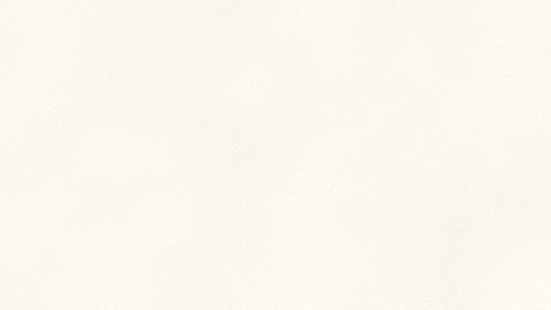
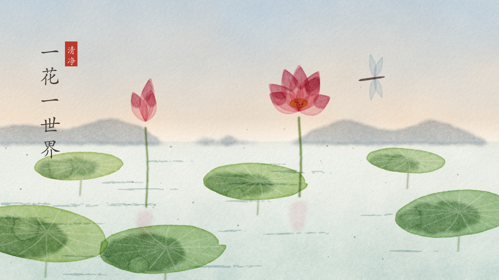

# Claude Drawing · Claude 绘图

**Claude paints with code — no image model.** Ink wash · watercolour · torn-paper collage.
**不用生图模型，Claude 用代码一笔一笔作画。** 水墨 · 水彩 · 剪纸拼贴。

[English](#english) · [中文](#中文)

| Ink wash · 水墨 | Watercolour · 水彩 | Paper collage · 剪纸拼贴 |
|---|---|---|
|  |  |  |

| 八万四千法门 · *Many paths, one summit* | 月印万川 · *One moon in ten thousand rivers* |
|---|---|
|  |  |
| **一花一世界** · *A world in a flower* | **小沙弥看月亮** · *The little monk and the moon* |
|  |  |

Every mark above is computed: paper fibres, ink washes and mist, dry-brush strokes, pigment granulation and blooms, torn-paper edges, crayon wax and newsprint. No diffusion model, no API, no stock art. It is just Python with **numpy + Pillow** on a CPU: 2–4 s for an ink painting and about 20 s for watercolour or collage, at 1920×1080.

---

## English

### What it is

A [Claude Code](https://claude.com/claude-code) skill and a small painting library with three styles:

| Style | Module | What makes it read as the real medium |
|---|---|---|
| **Ink wash (水墨)** | `lib/inkpaint.py` · `Painting` | rice paper; occluding washes with wet rims and mist; bristle brush with flying-white; texture strokes (皴); moss dots; pines, boats, reeds; a moon reserved in white; calligraphy and seal |
| **Watercolour** | `lib/watercolor.py` · `Watercolor` | cold-press paper tooth; *transparent glazes* that mix subtractively; wet-edge darkening; granulation; blooms (back-runs); wet-in-wet feathering; lifting; splatter |
| **Paper collage** | `lib/papercut.py` · `Collage` | torn edges with a white fibrous core; paper depth shadows; coloured, kraft, crayon, newsprint and ruled-notebook papers; waxy crayon lines; cute faces with blush |

Ask Claude to *"draw it yourself"*, *"paint this with code"*, or *"claude绘图"*. It then works in three steps:

1. **Plan the composition**: layers, a focal point, breathing space, one accent colour, and a subject that illustrates the idea rather than generic scenery.
2. **Write a short scene script** using the library.
3. **Render it, look at the result, and fix it** against a per-style checklist of real failure modes, usually over 2–4 rounds.

### Why code instead of an image model?

- **Directed composition**: placement, empty space and accents are exact, not sampled.
- **Reproducible**: the same seed gives the same painting.
- **Animatable**: `stage()` snapshots let a video show the painting *being made*. The GIFs above are exactly that; a generated bitmap can't do it.
- **Runs anywhere**: offline, on a CPU, with no GPU, key or quota.

### Install

```bash
git clone https://github.com/cloveric/claude-drawing-skill.git ~/.claude/skills/claude-drawing
pip install -r ~/.claude/skills/claude-drawing/requirements.txt   # numpy, Pillow
```

Titles and notes need a CJK font. macOS Kaiti/Songti, Linux Noto CJK and Windows KaiTi/SimSun are found automatically; you can also set `INKPAINT_FONT=/path/to/font`.

### Quick start

```python
import sys; sys.path.insert(0, "lib")

# ink wash
from inkpaint import Painting
p = Painting(1920, 1080, seed=7); p.paper()
far = p.ridge(560, peaks=[(420, 150, 330), (1650, 110, 260)]); p.wash(far, dens=0.16, decay=170, mist_y=700)
main = p.peak(1130, 252, shoulders=[(1380, 70, 90)]); p.wash(main, dens=0.46, decay=240, mist_y=920)
p.cun(main, 530, 1730, shadow_x=1130); p.trails(main, (1130, 252), n=16, red_index=7)
p.mist(960, 70, 0.8); p.sun(1500, 190, 46); p.save("ink.png")

# watercolour
from watercolor import Watercolor, hexc
from core import blob_pts
w = Watercolor(1920, 1080, seed=1); w.paper()
w.gradient_wash(0, 540, top=hexc('#8fb0cf'), bottom=hexc('#f2cfae'))
leaf = w.shape(blob_pts(900, 760, 260, 90, rough=0.1), soft=2.5)
w.glaze(leaf, hexc('#a9c46b'), 0.75, edge=0.55, gran=0.35, bloom=1); w.save("watercolour.png")

# paper collage
from papercut import Collage
c = Collage(1920, 1080, seed=2); c.background('#232d66', texture='kraft')
c.piece(mask=c.circle_mask(1360, 300, 150), colour='#f6d77a', texture='crayon')
c.face(1360, 310, 128, mood='sleep'); c.save("collage.png")
```

Full scenes: `python3 examples/<name>.py out.png --stages stages/`. `--stages` also writes the draw-on snapshots.

### Principles (the checklist Claude uses)

- **Ink**: paint far to near, and each wash occludes what is behind it. Tie dab spacing to bristle size so strokes never look beaded. Paths should be few, smooth and emerge from mist. Texture strokes should be long, follow the slope and sit on the shadow side. Ridge lines stay light and broken.
- **Watercolour**: keep the paper tooth subtle. Pool shadows wet-in-wet on one side (no bull's-eyes). Paint stems before leaves and keep them outside the leaf. Use at most three glazes in one place, and save lights or lift them out.
- **Collage**: big areas use flat or kraft paper, and crayon texture is only for accents. Torn white rims are 5–8 px wide and appear on only part of an edge. Shadows use a zero-padded shift, never a wrap-around one. A moon gets a halo, not sun rays.

### Roadmap

- Per-stroke layer export, for stroke-by-stroke animation in Motion Canvas or Remotion.
- More styles on the same core, such as gouache, woodblock print and pencil sketch.

---

## 中文

### 这是什么

一个 [Claude Code](https://claude.com/claude-code) skill，加上一个小巧的绘图库，内置三种画风：

| 画风 | 模块 | 为什么看起来像真的 |
|---|---|---|
| **水墨** | `lib/inkpaint.py` · `Painting` | 宣纸纹理；会遮挡身后的墨染山体，带水痕边和雾；分笔毛的毛笔与飞白；皴擦、苔点；松、孤舟、芦苇；烘云托月的留白月亮；题字与印章 |
| **水彩** | `lib/watercolor.py` · `Watercolor` | 冷压水彩纸纹理；**透明罩染**，叠色像真颜料一样变深、混色；水痕边；颜料颗粒；水渍花；湿画晕开；提白；甩点 |
| **剪纸拼贴** | `lib/papercut.py` · `Collage` | 撕纸露出的白色纤维边；纸片层叠的阴影；彩纸、牛皮纸、蜡笔、报纸、笔记本横线纸；蜡笔线条；带腮红的可爱圆脸 |

对 Claude 说「claude绘图」「你自己画」「用代码画」，它会：
1. **先定构图**：层次、焦点、留白、一处点睛色，而且画面要图解内容本身，不是随便一幅风景；
2. **写一段场景脚本**，调用绘图库；
3. **渲染并自己看图**，对照该画风的毛病清单修改，一般改 2–4 轮。

### 为什么用代码画，而不用生图模型

- **构图可控**：位置、留白、点睛色都精确可控，不靠抽卡。
- **可复现**：同一个随机种子，画出同一幅画。
- **能做「作画过程」动画**：用 `stage()` 存下每一步，视频里就能看到画被一步步画出来。上面的动图就是这样做的，生图模型只能给一整张画。
- **哪里都能跑**：离线、只用 CPU，不需要显卡、API Key 或额度。

### 安装

```bash
git clone https://github.com/cloveric/claude-drawing-skill.git ~/.claude/skills/claude-drawing
pip install -r ~/.claude/skills/claude-drawing/requirements.txt   # numpy、Pillow
```

题字和纸条需要中文字体。macOS 的楷体/宋体、Linux 的 Noto CJK、Windows 的楷体/宋体都会自动找到，也可以用 `INKPAINT_FONT=字体路径` 指定。

### 快速上手

三种画风的最小示例见上方英文部分的代码。完整范例：

```bash
python3 examples/bawansiqian.py       out.png --stages stages/   # 水墨：八万四千法门
python3 examples/moon_river.py        out.png                    # 水墨：月印万川
python3 examples/watercolor_lotus.py  out.png                    # 水彩：一花一世界
python3 examples/papercut_moon.py     out.png                    # 剪纸：小沙弥看月亮
```

### 作画要点（Claude 交图前逐条自查）

- **水墨**：先远后近，每层墨染遮挡身后；落笔间距跟笔毛挂钩，笔画不会一节一节；小路要少、平滑、从雾里伸出来；皴擦长而顺坡、集中在阴面；山脊线要淡而断续。
- **水彩**：纸纹要细；阴影用湿画偏一侧积色，不要画成靶心；先画叶梗，并且只画在叶子外面；同一处罩染不超过三层，亮部留白或提白。
- **剪纸**：大色块用平纸或牛皮纸，蜡笔只做点缀；撕口白边宽 5–8 像素，只出现在部分边缘；阴影偏移要补零，不能首尾相接；月亮用光圈，不画放射线。

### 计划

- 按笔画分层导出，方便在 Motion Canvas / Remotion 里做逐笔动画。
- 在同一套底层上扩展更多画风：水粉、木刻版画、铅笔素描。

---

MIT License · Made by Claude (Opus 5.5) with [@cloveric](https://github.com/cloveric)
