# Claude Drawing · Claude 绘图

**Claude paints with code — no image model.** Forty-three styles, from ink wash and impasto oil to clay, cyanotype, stained glass, an Egyptian tomb painting, a Roman mosaic, a cyberpunk street, a ray-traced ball pit, low-poly 3D, an ASCII line printer and a synthwave sunset.
**不用生图模型，Claude 用代码一笔一笔作画。** 四十三种画风，从水墨、油画到黏土、蓝晒、彩色玻璃花窗、古埃及墓室壁画、罗马马赛克、赛博朋克、光线追踪的小球海、低多边形 3D、ASCII 字符画和 Synthwave 落日。

[English](#english) · [中文](#中文)

<p align="center"><br><sub><b>Ink wash · 水墨</b> — every style below is drawn stage by stage like this · 下面每种画风都是这样一步步画出来的</sub></p>

| Isometric 2.5D · 等轴 2.5D | Perler beads · 拼豆 |
|---|---|
|  | 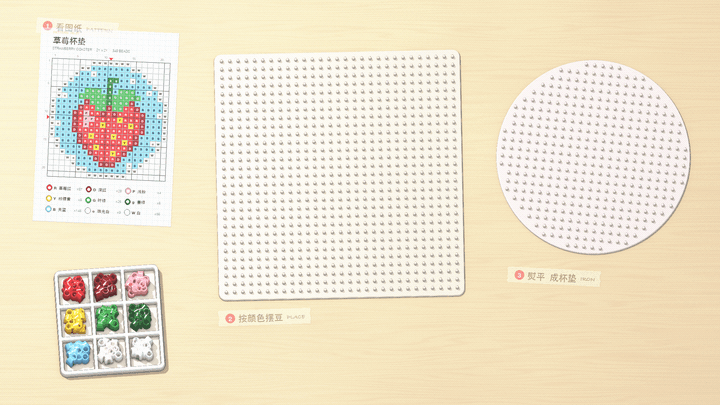 |

| Watercolour · 水彩 | Paper collage · 剪纸拼贴 | Coloured pencil · 韩国彩铅 | Anime · 日本动漫 |
|---|---|---|---|
|  |  |  |  |
| **Editorial · 编辑风手绘** | **Impasto oil · 油画厚涂** | **Ukiyo-e · 浮世绘木版画** | **Pixel art · 像素风** |
|  |  |  |  |
| **Stop-motion clay · 黏土定格** | **Cyanotype · 蓝晒** | **Cross-stitch · 十字绣** | **Retro panel · 复古仪器面板** |
|  |  |  |  |
| **Sticker collage × receipt · 贴纸拼贴 · 小票** | **Lab notebook × stickers · 实验笔记本 · 贴纸** | **Chalkboard · 黑板板书** | **Cyberpunk · 赛博朋克** |
|  |  |  |  |
| **Hand-drawn cartoon · 卡通手绘** | **Continuous line art · 单线画** | **Soft 3D · 柔光 3D** | **Shape morph · 形变动画** |
|  |  |  |  |
| **Newspaper collage · 报刊拼贴** | **Aurora glass · 弥散玻璃** | **Bauhaus geometric · 包豪斯几何** | **Retro synthwave · 复古 Synthwave** |
|  |  |  |  |

| Petroglyph · 岩画 | Egyptian tomb painting · 古埃及墓室壁画 | Roman mosaic · 罗马马赛克 | Stained glass · 彩色玻璃花窗 |
|---|---|---|---|
| 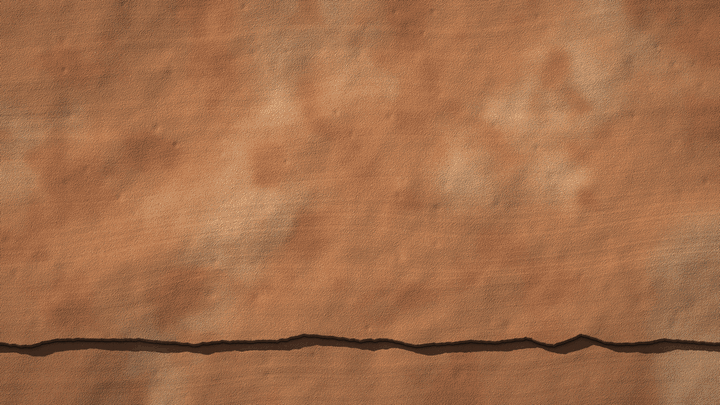 | 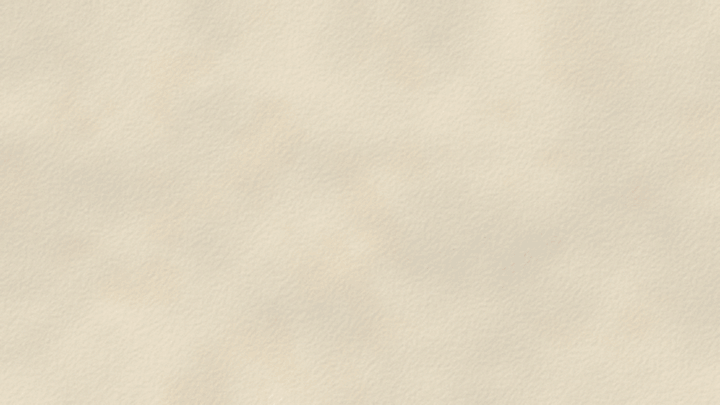 | 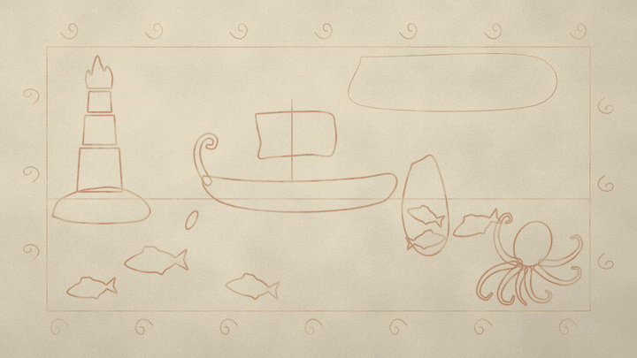 | 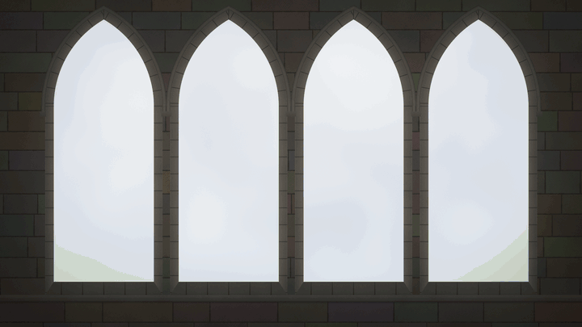 |
| **Illuminated manuscript · 泥金手抄本** | **Leonardo codex · 达·芬奇手稿** | **Silhouette · 剪影** | **Letterpress poster · 凸版印刷海报** |
| 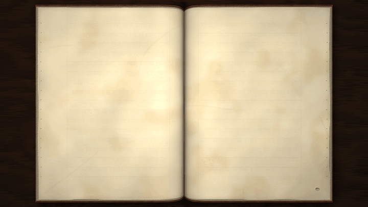 | 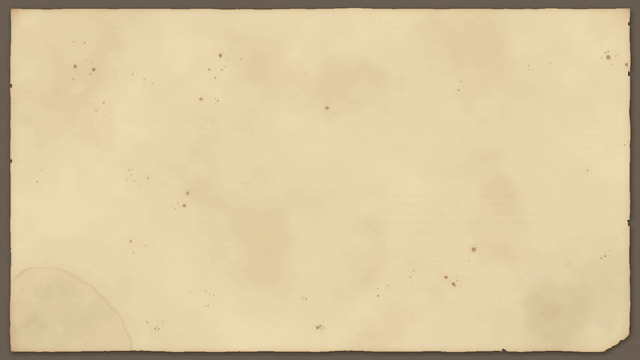 | 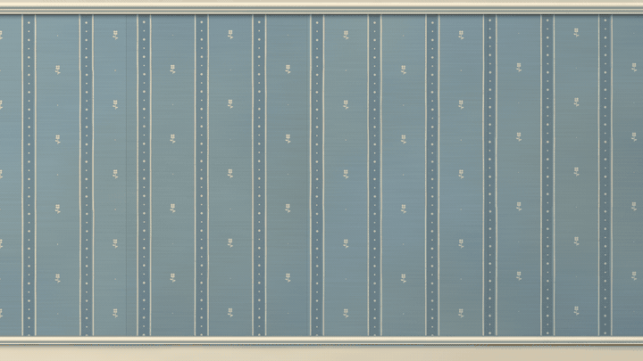 | 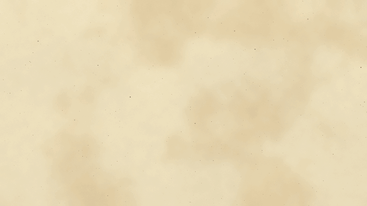 |
| **Soviet constructivism · 苏联构成主义** | **Art Deco · 装饰艺术** | **Golden-age comic · 黄金时代漫画** | **Pop silkscreen · 波普丝网** |
| 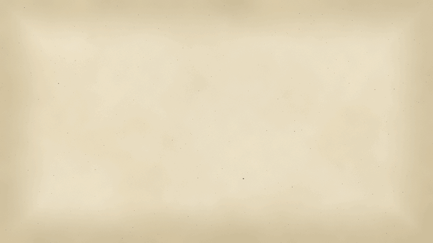 | 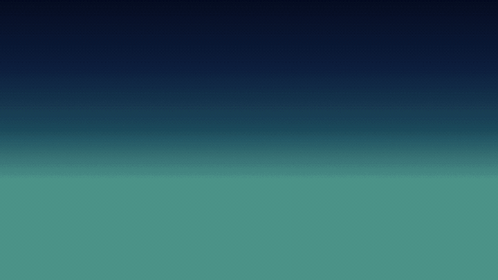 | 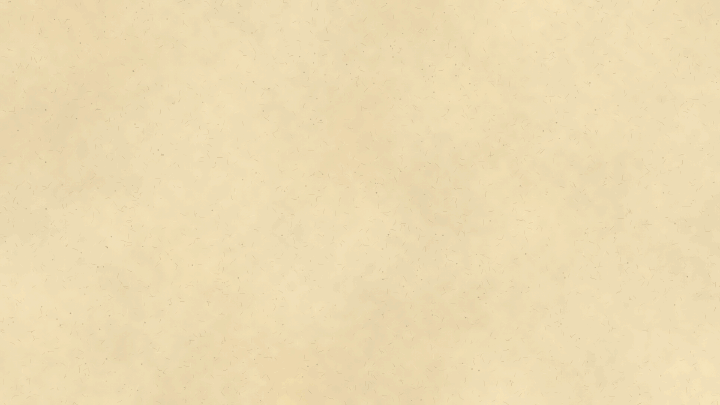 | 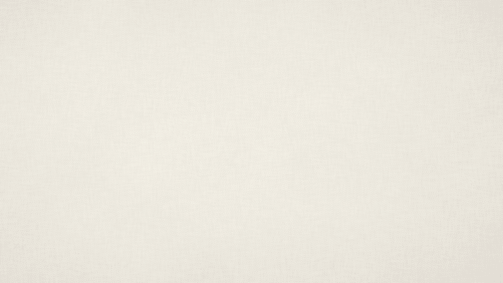 |
| **ASCII art (line printer) · ASCII 字符画** | **Low poly · 低多边形** | **Stencil graffiti · 喷漆模板涂鸦** | **Embroidered patches · 刺绣徽章** |
| 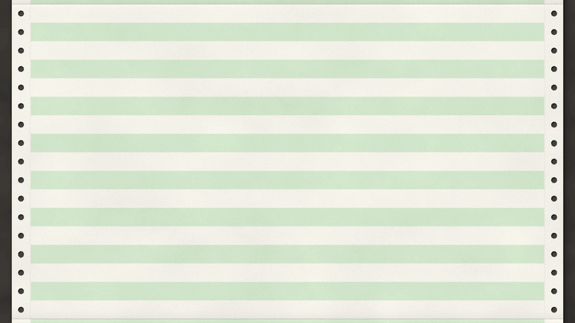 | 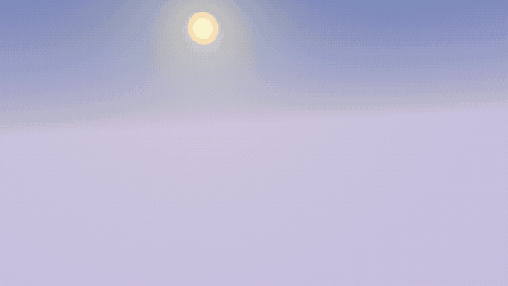 | 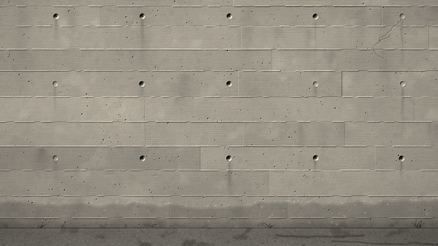 | 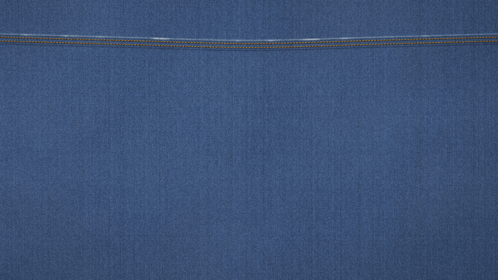 |

### Gallery · 画廊

| | |
|---|---|
| **八万四千法门** · *Many Paths, One Summit*<br><sub>Ink wash · 水墨</sub> | **月印万川** · *One Moon in Ten Thousand Rivers*<br><sub>Ink wash · 水墨</sub> |
|  |  |
| **秋日湖畔** · *Autumn Lake*<br><sub>Watercolour · 水彩</sub> | **热气球小镇** · *Balloon Day*<br><sub>Paper collage · 剪纸拼贴</sub> |
|  |  |
| **午后甜点** · *Afternoon Dessert*<br><sub>Coloured pencil · 韩国彩铅</sub> | **夏空** · *Summer Sky*<br><sub>Anime · 日本动漫</sub> |
|  |  |
| **灵感生长** · *Growing Ideas*<br><sub>Editorial · 编辑风手绘</sub> | **麦田星空** · *Swirling Sky over the Wheat Field*<br><sub>Impasto oil · 油画厚涂</sub> |
|  |  |
| **富士曙** · *Fuji at Dawn*<br><sub>Ukiyo-e · 浮世绘</sub> | **雨夜咖啡店** · *Rainy Night Cafe*<br><sub>Pixel art · 像素风</sub> |
|  |  |
| **灯塔岛** · *Lighthouse Island*<br><sub>Stop-motion clay · 黏土定格</sub> | **蓝晒植物** · *Sun-Print Botanicals*<br><sub>Cyanotype · 蓝晒</sub> |
|  |  |
| **家** · *Home Sampler*<br><sub>Cross-stitch · 十字绣</sub> | **Aurora 64 收音机** · *Aurora 64 Radio*<br><sub>Vintage instrument panel · 复古仪器面板</sub> |
|  |  |
| **周末市集** · *Weekend Market*<br><sub>Sticker collage × receipt · 贴纸拼贴 · 小票</sub> | **咖啡萃取实验** · *Coffee Brewing Experiment*<br><sub>Lab notebook × stickers · 实验笔记本 · 贴纸</sub> |
|  |  |
| **为什么天空是蓝的** · *Why Is the Sky Blue?*<br><sub>Chalkboard · 黑板板书</sub> | **霓虹不夜城** · *Neon District*<br><sub>Cyberpunk · 赛博朋克</sub> |
|  |  |
| **早安吐司** · *Good Morning, Toast*<br><sub>Hand-drawn cartoon · 卡通手绘</sub> | **岛上的气象站** · *Island Weather Station*<br><sub>Isometric 2.5D · 等轴 2.5D</sub> |
|  |  |
| **从这扇窗到那扇窗** · *From Window to Window*<br><sub>Continuous line art · 单线画</sub> | **浮出** · *Rise*<br><sub>Soft 3D · 柔光 3D</sub> |
|  |  |
| **一滴水的旅程** · *A Drop's Round Trip*<br><sub>Shape morph · 形变动画</sub> | **好奇心周刊 · 拆开看看** · *Curiosity Weekly · Take It Apart*<br><sub>Newspaper collage · 报刊拼贴</sub> |
|  |  |
| **晨间计划** · *Morning Plan*<br><sub>Aurora glassmorphism · 弥散玻璃</sub> | **形与色** · *Form & Colour*<br><sub>Bauhaus geometric · 包豪斯几何</sub> |
|  |  |
| **海岸线 1987** · *Coastline 1987*<br><sub>Retro synthwave · 复古 Synthwave</sub> | **草莓杯垫** · *Strawberry Coaster*<br><sub>Perler beads · 拼豆</sub> |
|  | 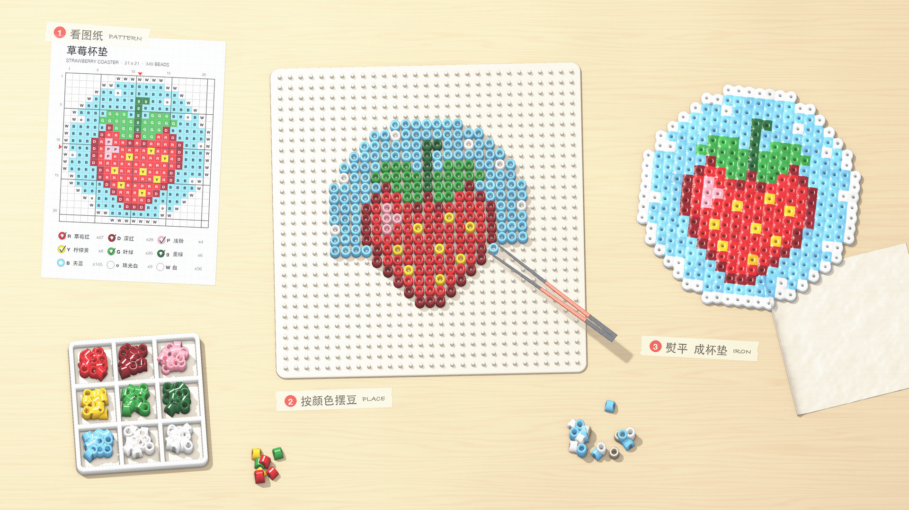 |
| **迁徙季** · *Migration Season*<br><sub>Petroglyph · 岩画</sub> | **尼罗河丰收** · *Harvest on the Nile*<br><sub>Egyptian tomb painting · 古埃及墓室壁画</sub> |
| 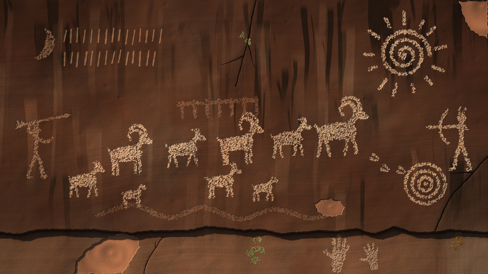 | 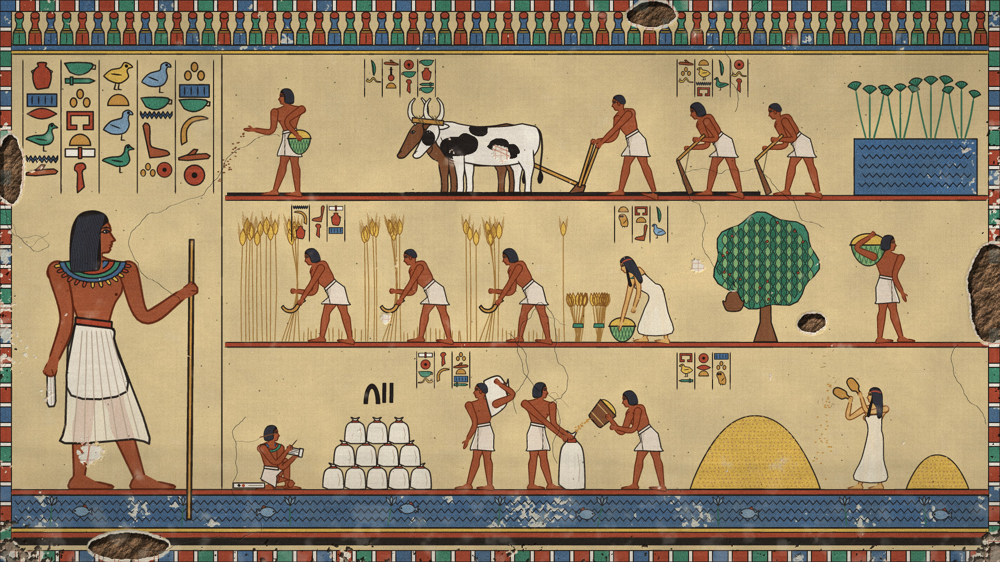 |
| **港口渔获** · *The Day's Catch*<br><sub>Roman mosaic · 罗马马赛克</sub> | **四季之窗** · *Window of the Seasons*<br><sub>Stained glass · 彩色玻璃花窗</sub> |
| 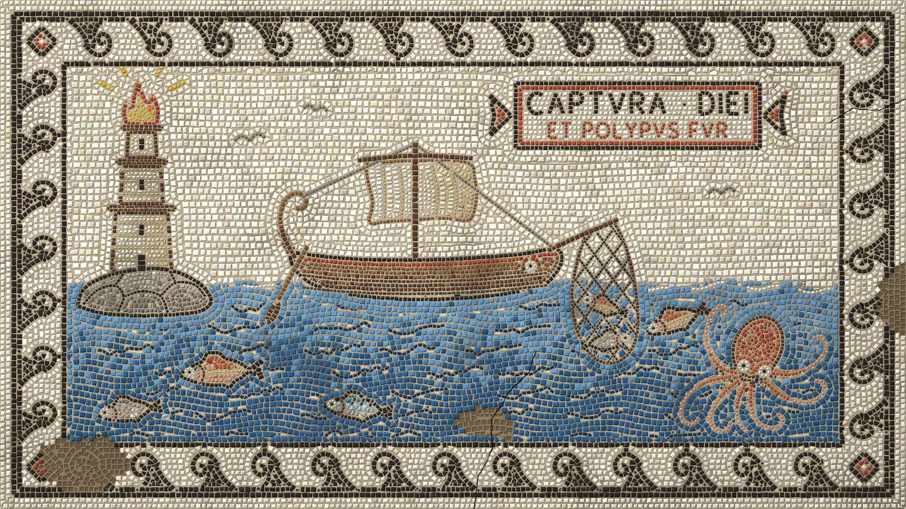 | 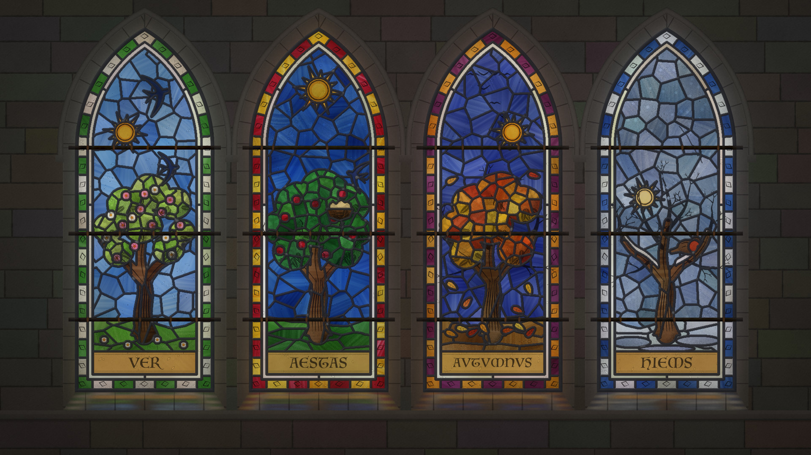 |
| **星辰之书** · *Liber Stellarum*<br><sub>Illuminated manuscript · 泥金手抄本</sub> | **扑翼机** · *The Ornithopter*<br><sub>Leonardo codex · 达·芬奇手稿</sub> |
| 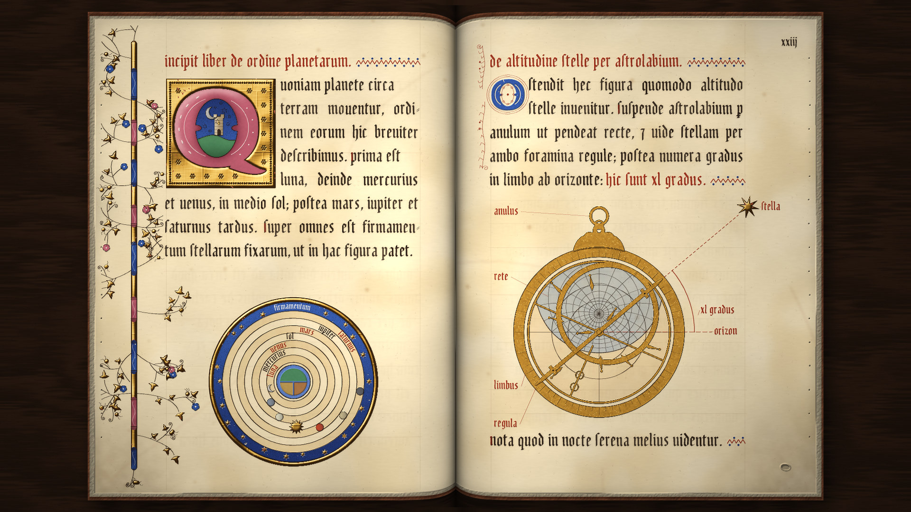 | 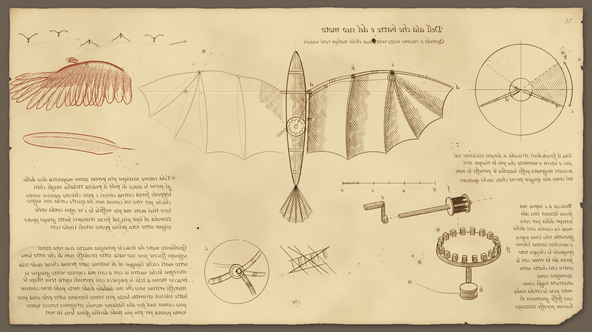 |
| **剪影小像** · *Shades of the Wren Household*<br><sub>Silhouette · 剪影</sub> | **马戏团来了** · *The Circus Is Coming*<br><sub>Letterpress poster · 凸版印刷海报</sub> |
| 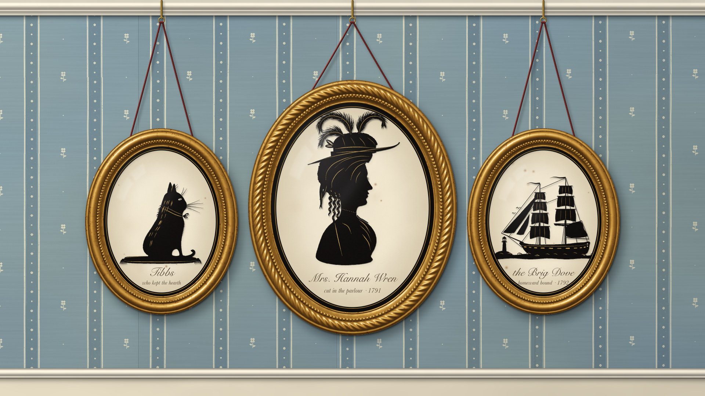 | 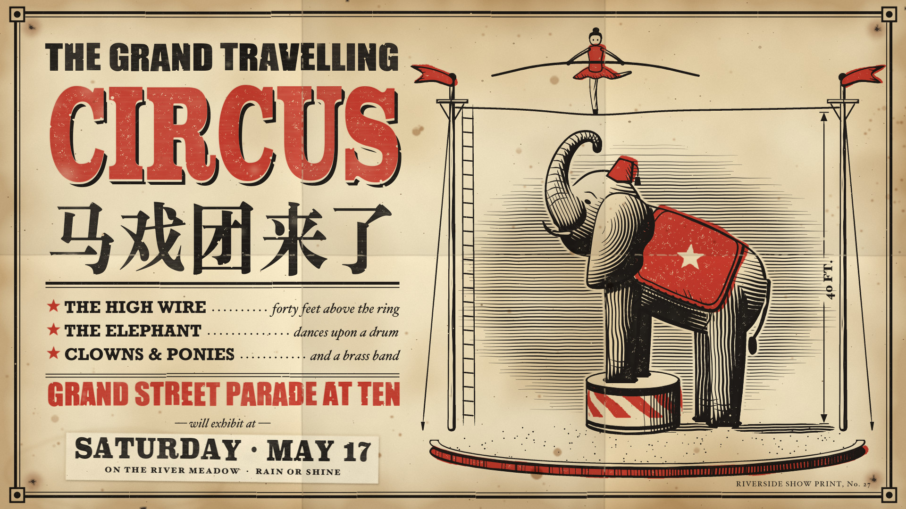 |
| **无线电** · *Radio*<br><sub>Soviet constructivism · 苏联构成主义</sub> | **夜行快车** · *Night Express*<br><sub>Art Deco · 装饰艺术</sub> |
| 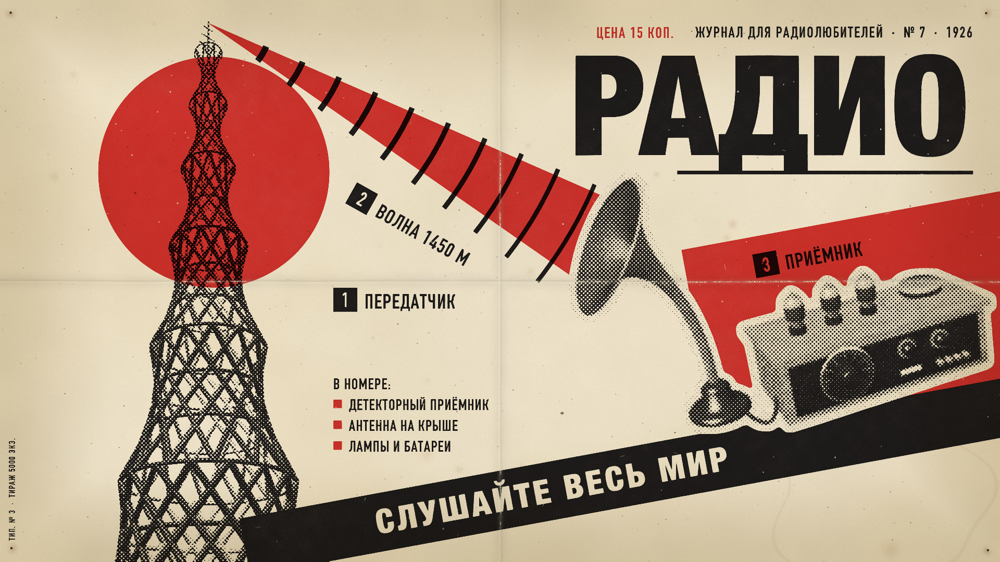 | 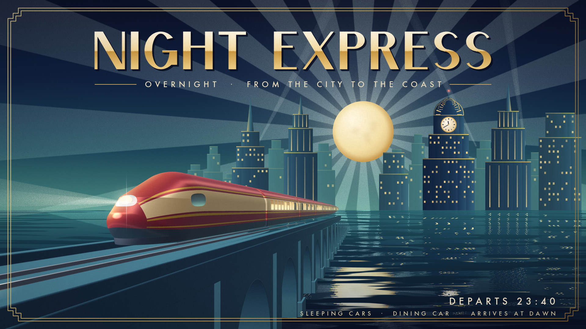 |
| **火箭小队** · *Rocket Squad*<br><sub>Golden-age comic · 黄金时代漫画</sub> | **猫的六种心情** · *Six Moods of a Cat*<br><sub>Pop silkscreen · 波普丝网</sub> |
| 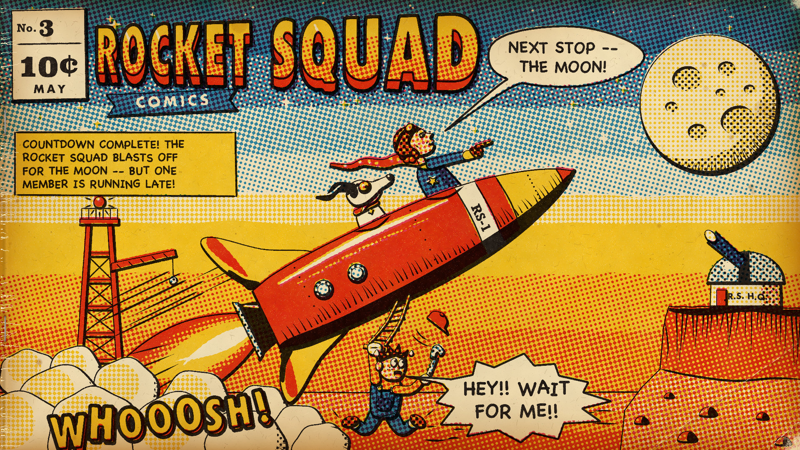 | 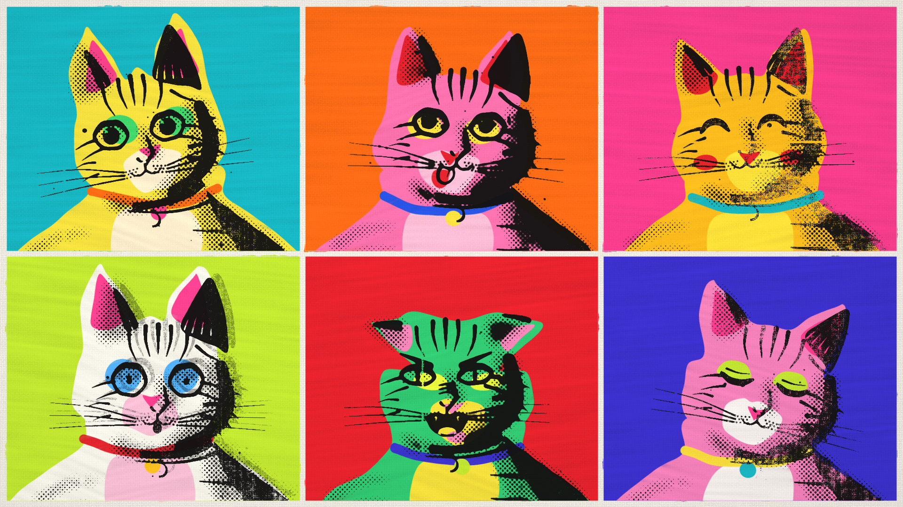 |
| **发射记录** · *Liftoff Trace*<br><sub>ASCII art (line printer) · ASCII 字符画（行式打印机）</sub> | **峡谷飞行** · *Canyon Run*<br><sub>Low poly · 低多边形</sub> |
| 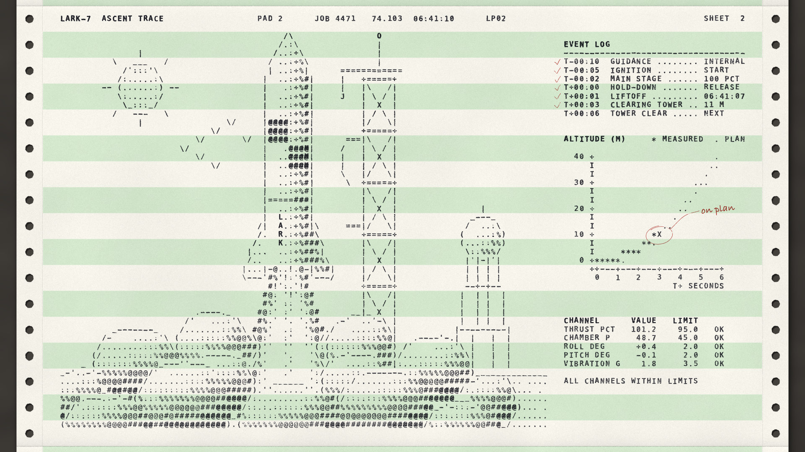 | 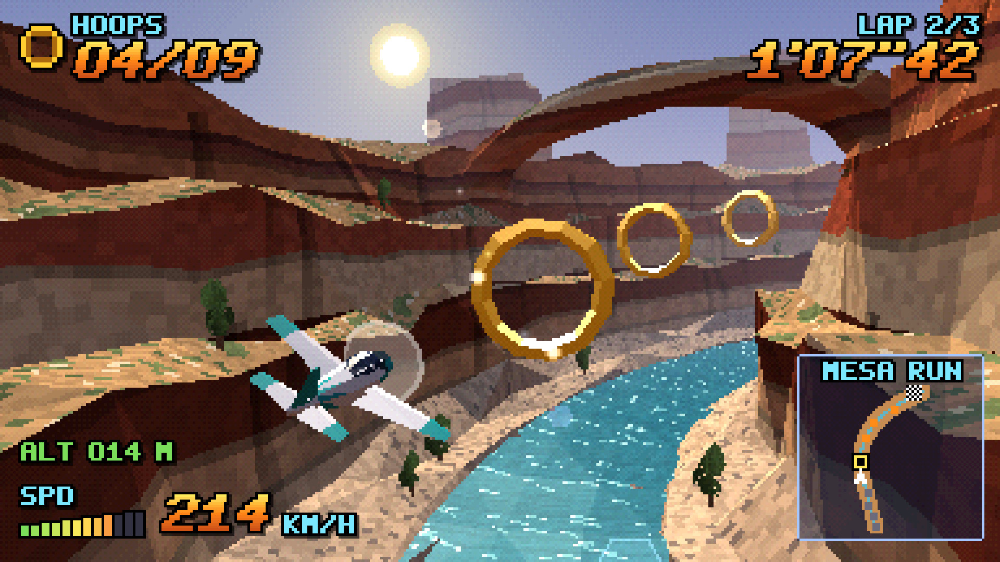 |
| **放风筝** · *Hold On*<br><sub>Stencil graffiti · 喷漆模板涂鸦</sub> | **三晚露营** · *Three Nights Out*<br><sub>Embroidered patches · 刺绣徽章</sub> |
| 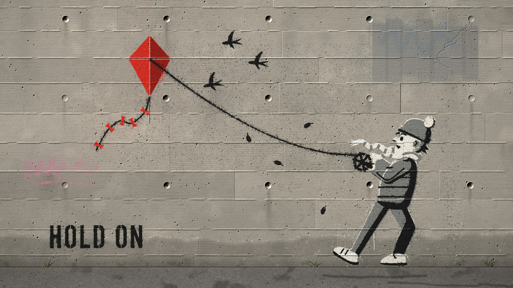 | 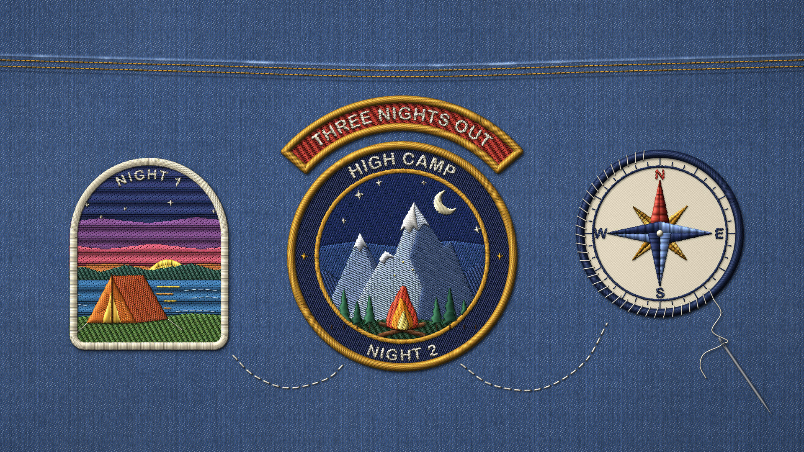 |

Every mark above is computed: paper fibres, ink washes and mist, dry-brush strokes, pigment granulation and blooms, torn-paper edges, pencil wax on paper tooth, cel-shaded clouds, risograph grain and halftones, lit impasto relief, woodblock grain and bokashi, dithered pixels, plasticine lit like a film set, sunlight through leaves on Prussian blue, twisted thread on Aida cloth, machined knobs behind a backlit dial, die-cut vinyl with a laminate gloss, streaky thermal print, graphite catching the tooth of graph paper, highlighter pooling at the start of a swipe, chalk dust settling under half-erased lessons, rain-lit neon glass mirrored in a wet street, a blue-pencil rough under boiling brush ink, an island ray-traced under one soft sun, a single unbroken gold line, candy balls with softbox glints, one outline morphing through six shapes, halftone photos cut out with scissors, frosted glass blurring the real pixels behind it, screen-printed primaries out of register, a slit sun sinking behind a neon grid played off tape, hollow fuse beads on a pegboard melting together under an iron. No diffusion model, no API, no stock art. It is just Python with **numpy + Pillow** on a CPU: from 0.1 s (pixel art) to about 45 s (the soft 3D ray tracer) per 1920×1080 image.

---

## English

### What it is

A [Claude Code](https://claude.com/claude-code) skill and a small painting library with forty-three styles:

| Style | Module | What makes it read as the real medium |
|---|---|---|
| **Ink wash (水墨)** | `lib/inkpaint.py` · `Painting` | rice paper; occluding washes with wet rims and mist; bristle brush with flying-white; texture strokes (皴); moss dots; pines, boats, reeds; calligraphy and seal |
| **Watercolour** | `lib/watercolor.py` · `Watercolor` | cold-press paper tooth; *transparent glazes* that mix subtractively; wet-edge darkening; granulation; blooms; wet-in-wet feathering; reflections; lifting |
| **Paper collage** | `lib/papercut.py` · `Collage` | torn edges with a white fibrous core; paper depth shadows; kraft, crayon, newsprint and ruled-notebook papers; waxy crayon lines; cute faces |
| **Coloured pencil (Korean style)** | `lib/colorpencil.py` · `ColorPencil` | short directional hatching; wax that catches on the paper tooth, with pressure reaching the valleys; soft layered blending; brown pencil outlines; gel-pen sparkles |
| **Anime (Japanese)** | `lib/anime.py` · `Anime` | gradient skies; cumulus with *crescent* cel shadows on every puff; bloom, god rays, lens flare; flat-shaded fields, perspective roads, power lines; line-art characters |
| **Editorial (risograph)** | `lib/editorial.py` · `Editorial` | 4–5 spot inks with grain, uneven density and mis-registration; overprinting; halftone shading; wobbly hand-drawn line; stylised figures |
| **Impasto oil** | `lib/oilpaint.py` · `OilPainting` | thousands of strokes following a *flow field*; each pixel knows its place inside its stroke → flat-topped paint ridges, bristle grooves, heavier paint where the brush lands; lit relief |
| **Ukiyo-e woodblock** | `lib/ukiyoe.py` · `Ukiyoe` | one block per colour on washi, with wood grain and registration drift; *bokashi* graded wipes; black key-block outlines; seigaiha waves; cloud bands; title cartouche and seal |
| **Pixel art** | `lib/pixelart.py` · `PixelArt` | a 320×180 canvas painted pixel by pixel; limited palette; ordered (Bayer) dithering for gradients, glows and reflections; 3×5 bitmap font; crisp ×6 upscale |
| **Stop-motion clay** | `lib/clay.py` · `Clay` | a *height map* of pressed pieces (pads, balls, rolled snakes, puffy letters, finger-smeared slabs, tool grooves, pokes) with lumps and fingerprints; lit like a photo of a set: wrap-diffuse key + cool fill, waxy sheen, shadows marched through the height field, ambient occlusion |
| **Cyanotype (sun print)** | `lib/cyanotype.py` · `Cyanotype` | emulsion brushed on in strokes with dry-brush ends; objects *block UV* (transmissions multiply): translucent leaves with whiter veins, fluff lifted off the paper with a soft penumbra, light scattering under edges; a Prussian-blue density curve; white handwriting printed in, pencil notes on the margin |
| **Cross-stitch embroidery** | `lib/stitch.py` · `Stitch` | Aida cloth with a hole at every block corner; one X per cell, lit as round twisted thread with a shadow, in hand-made variants; half stitches; back-stitch snapped hole to hole; padded glossy satin stitch; French knots; ASCII charts and a 5×7 sampler alphabet; a sewn-on woven label |
| **Vintage instrument panel** | `lib/panel.py` · `Panel` | teak veneer, brushed aluminium, moulded plastic, grille cloth with lurex floats, perforated metal; bevels, wells and drop shadows from one key light; machined knobs, piano keys, toggle switch, jewel lamp, magic-eye tube, meter; silkscreened scales and a backlit dial behind glass |
| **Sticker collage × receipt** | `lib/sticker.py` · `Sticker` | cream card board with grain, mottling and fibres; flat-vector art die-cut into *vinyl stickers* (rounded white border, cut-edge thickness, laminate gloss rim and sheen, contact + drop shadow, peeled corners showing the pale backing); a thermal receipt with serrated tear edges, grey streaky thermal print, dotted leaders, a printed strike-through, a fold crease and curl; translucent washi tape with torn ends; price tags with grommets on baker's twine; a round rubber stamp in translucent, unevenly pressed ink; red ballpoint ticks |
| **Lab notebook × stickers** | `lib/notebook.py` · `Notebook` | a wire-o graph-paper notebook on a graphite desk (hard back cover, stepped page stack, divider tabs, dog-ear, wire loops lit as metal tubes); graphite that only catches the paper tooth, with pressure, taper and hand wobble; ruled lines, hatching, pencil charts and check boxes; multiply highlighter swipes with pooled starts, felt streaks and dry tails; red felt-pen loops that overshoot instead of closing; curling sticky notes, die-cut vinyl stickers, embossed label-maker tape, a coffee ring; a hexagonal pencil with a scalloped sharpened edge |
| **Chalkboard** | `lib/chalk.py` · `Chalkboard` | cloudy green slate paint; chalk that only catches the board's tooth, with pressure, grain and broken edges; side-of-the-stick shading; a felt eraser that really removes chalk, drags a smear along the wipe and leaves ghosts of the last lesson; dust settling thicker toward the tray; hand-set text where each character sits a little differently; hand-drawn ∝, waves, arrows and open loops; a mitred wooden frame with chalk sticks and an eraser on the ledge |
| **Cyberpunk** | `lib/cyberpunk.py` · `Cyberpunk` | a pinhole camera down a rain-soaked street canyon, rendered in HDR with a z-buffer: glass-tube neon with over-exposed cores, dead and flickering tubes; backlit light boxes; a translucent hologram ad with scan lines, tear slices and colour fringing; each object mirrored from its own ground line into the wet asphalt and puddles; depth fog lit by the city; steam lit by the signs; three layers of rain lit only near the neon; flying-car light trails; bloom, halation, grain and one glitch line |
| **Hand-drawn cartoon** | `lib/cartoon.py` · `Cartoon` | drawn the way an animator draws one frame: a blue col-erase pencil rough left under everything; brush-pen ink that lands thin, swells and lifts off to a point, closed shapes inked in one stroke whose ends overlap, heavier on the shadow side; flat colour painted a little off the lines (a sliver of paper here, a spill there); hard one- or two-tone cel shadows and white glints; crayon that only catches the paper tooth, screentone, ink hatching; faces, rubber-hose arms with mitten gloves, sparkles, speed lines, starbursts; chunky extruded lettering; lines that boil from frame to frame; a staged replay rough → ink → colour → shadow → effects → type |
| **Isometric 2.5D** | `lib/isometric.py` · `Isometric` | a true isometric orthographic camera and a small ray tracer: every part is an exact analytic solid (chamfered boxes, roofs, rocks and hulls as convex polyhedra; cylinders and cones on any axis; ellipsoids cut by planes) in a G-buffer, so hiding never depends on draw order; one soft sun gives the three-tone faces and percentage-closer soft shadows that widen with distance; occlusion comes from a top-down map that knows eaves and tree crowns float; pastel albedos under a lilac sky, chamfer highlights, shore foam, glassy water walls, a floating slab whose shadow lands on the backdrop; data cards printed on iso planes |
| **Continuous line art** | `lib/lineart.py` · `LineArt` | the whole picture is one path: shapes strung together in drawing order with tangent-continuous bridges, loop-the-loops laid along the path, invisible retraces to reach a window; rasterised once into a time map, so every draw-on stage is an exact prefix of the line; a hand-pressure width (touch-down and lift-off tapers, slow drift, heavier in sharp turns, a flick where the pen doubles back, a lighter hand for motion paths); a gilded wire with angle-dependent sheen and a faint, tight glow on night blue (or dark ink on cream); a hot pen tip while drawing; one glowing accent; letter-spaced Didot titles |
| **Soft 3D** | `lib/soft3d.py` · `Soft3D` | an actual little ray tracer: tens of thousands of balls found by walking a grid (DDA) with exact ray–sphere hits; puffy letters as signed distance fields (exact 2D distance transform of the glyph, extruded, rounded and inflated); a studio sky dome with ambient occlusion sampled in the scene's own distance field; a big softbox key with soft penumbra shadows, a rim light, softbox reflections and Fresnel edges; shade that turns deeper and more saturated instead of grey; displaced balls that settle into real hollows; aerial haze, layered depth of field, 1.5× supersampling |
| **Shape morph** | `lib/morph.py` · `Morph` | one closed outline per object: resampled to 256 points evenly along its arc length, given the same winding, start point aligned by FFT cross-correlation, then blended point by point while its centroid travels an eased motion path with squash & stretch; compound shapes (cloud, snowflake) are unions of primitives traced back to a single outline; colours switch through OKLab; the poster freezes the animation as a film strip: one flat colour panel per keyframe, onion-skin ghosts that change colour at the panel border, matched points dotted on the middle frame, a dashed motion path and a timeline of ease curves |
| **Newspaper collage** | `lib/newscollage.py` · `NewsCollage` | everything is paper that was printed, then torn or cut, then glued: kraft board with fibres; hand-torn newsprint of generated pseudo-text that shows a pale fibrous core along stretches of the tear; "old photos" that are real renders (height field, key light, chrome reflections, cast shadows) printed as a 45° halftone with ragged dots and dot gain, cut out with scissors in short straight snips; ransom-note letters each from a different magazine; masking tape that shows the paper edges beneath; uneven rubber stamps |
| **Aurora glassmorphism** | `lib/aurora.py` · `Aurora` | a mesh gradient of colour pools mixed in OKLab on a domain-warped grid, with aurora ribbons and fine grain; glossy iridescent orbs; frosted panes that blur the *actual* pixels beneath them (backdrop, orbs, the cards and text behind), boost saturation and add a milky veil that is thicker toward the light; a bevelled rim that bends the view outward with faint dispersion, a light-facing 1 px edge highlight, frost grain and a soft shadow tinted by what it falls on; crisp SDF controls: gradient toggles, sliders, conic progress rings, pill bars, sparklines, glass chips, a glossy sun behind a glass cloud; SF + PingFang lettering |
| **Bauhaus geometric** | `lib/bauhaus.py` · `Bauhaus` | a press sheet printed screen by screen, light to dark, on cream uncoated stock (cloudy pulp, fibres, flecks, tooth, a slight cockle); each screen has its own registration error, so colour meets black with a sliver of paper or a dark overlap and the register targets print as a stack of offset crosshairs; an ink film streaked along the squeegee pull and thinning toward the end of the stroke, with bare tooth pits and pinholes where it is thin and a mesh-ragged stencil edge; semi-opaque inks that darken where they overprint; circles, sectors, triangles and heavy bars on a strict module grid; Futura-style caps and heavy Hei, knocked out of solids; crop marks, a colour bar and a pencilled edition number |
| **Retro synthwave** | `lib/synthwave.py` · `Synthwave` | an 80s retro-future dusk through a pinhole camera: a gradient sun cut by slits that thicken toward the horizon; an analytic neon grid with honest line widths that fades to its average instead of moiré; wireframe mountains glowing magenta to cyan; a sea whose reflection is torn into bars stretched about the sun's column; palm silhouettes with sunset rims; chrome caps mirroring sky over ground with a sharp horizon, extrusion and glints; neon script; then played back off tape: chroma bleed, a tracking band, head-switching noise, on-screen display and scanlines |
| **Perler beads** | `lib/perler.py` · `Perler` | a height field of real tubes seen by a camera leaning back a little (each pixel walks its column to the first surface), so every bead shows a sliver of side wall, its hole shows the inner wall and the peg inside tinted by light through the plastic, and the gaps show the pegboard; a translucent pegboard (square, round, hexagonal) with empty pegs; per-bead dye-lot shade and wobble; opaque, pearl, clear and glow plastics; ironing as melt: tubes slump and spread, holes close from the rim, neighbours flow together through a smooth union until the gaps shrink to diamonds and the top becomes one flat waxy sheet with paper grain; translucent ironing paper that drapes over the beads and peels back with a curl; a soft box seen in reflection (crisp arcs on glossy rims, a drifting sheen on melted plastic); sorting-tray heaps, spilled beads, tweezers held in the air with their own shadow, a printed chart with pencil ticks |
| **Petroglyph** | `lib/petroglyph.py` · `Petroglyph` | the picture is knocked out of the rock, not painted on: a sandstone height field (swells, faint bedding, grain, solution pockets, a stepped ledge) under desert varnish that grows as a near-uniform dark coat with crisp blue-black runoff streaks; every glyph is drafted as a mask and hammered out with hundreds to thousands of irregular pits that break the varnish and crush the grains pale, so outlines are ragged at the scale of one blow and interiors are shallow granular hollows; tally marks are ground V-grooves instead; age re-varnishes old work toward a ghost, so superimposed layers show; cracks bleed seep streaks; spalls are scalloped step-down scars of fresh orange stone that took part of the old work; crustose lichen; one low raking sun with a cast shadow in every pit |
| **Egyptian tomb painting** | `lib/tomb.py` · `TombPainting` | the wall is built in the painters' own order and every layer is kept: straw-tempered mud under gypsum plaster, a red-ochre squaring grid snapped at one canon unit per cell, a searching red underdrawing, a ground wash brushed round the figures, flat matte secco colour one pigment at a time (red-ochre men, yellow-ochre women, translucent pleated linen, glittering Egyptian blue, green frit) z-ordered so the pots can go in any order, then even black and red-brown outlines; figures in the composite view on a posable canon rig (profile head with a frontal kohl-lined eye, frontal shoulders and collar that turn toward profile when the body bends, both feet from the big-toe side, IK elbows) at hierarchical scale; oxen with all four legs visible, an emmer field gathered into the reapers' fists, polychrome pseudo-hieroglyphs laid out in quadrats, kheker frieze and block border; then age as strata: clustered flaking down to the wash, or to the plaster where the red grid and sketch come back, plaster losses down to the mud as a real height field with a broken gypsum rim and a cast shadow, cracks, blue decaying to grey-green, soot, a tide-line, salt and fly specks |
| **Roman mosaic** | `lib/mosaic.py` · `Mosaic` | a hidden cartoon that every stone samples and snaps to a finite box of stones (limestone, veined marble, smalti glass, terracotta), matched on hue before lightness; rows traced along iso-lines of distance fields (marching squares) so they wrap every outline and ring every eye (opus vermiculatum), halo rows round each figure, straight or wavy background rows (opus tessellatum), mitred border rows; each row fitted with a whole number of hand-cut stones that turn into wedges on curves and stop at the figure's spine; later stones cut to fit against earlier ones with a grout gap; stroke Roman capitals in a tabula ansata; a height field: polished, slightly domed tops with worn edges, recessed sandy grout, a per-stone tilt so equal stones catch the raking light differently, cast shadows in the joints; red-ochre sinopia on the wet bed; lacunae that leave the sockets of lost stones in the old bed, a settling crack, dirt in patches |
| **Stained glass** | `lib/stainedglass.py` · `StainedGlass` | the glazier's process: a cartoon cut into pieces (Voronoi mosaics, explicit cut sites for borders, slivers merged away); pot-metal glass coloured all the way through, every piece with its own shade and thickness (transmission ** thickness), reams running one way per piece and seed bubbles drawn out along them; grisaille trace lines, stippled matt with sticklight scratched out of it, silver stain; lead came on every boundary, lit as an H-section, with brighter solder blobs and a wide rim came; iron saddle bars wired to the leads, a crack mended with a strap lead; an ashlar wall with splayed reveals and voussoir joints; daylight from behind: coloured spill on the stone, glowing reveals, a soft upside-down projection on the sill, halation over the leads, grime and corrosion pits |
| **Illuminated manuscript** | `lib/illuminated.py` · `Illuminated` | textura written with a simulated broad-edged quill (a stroke is the area an angled nib sweeps, so the diamond feet and hairline joins come from the pen, not a font), with long s, the Tironian et and a per-letter wobble; iron-gall ink that browns as the quill runs dry and pools at the stroke edges; vermilion rubrics, red-touched capitals, red and blue paragraph marks, line fillers, hyphenation; burnished gold as a mirror on a raised gesso cushion (each pixel reflects a studio window through its gesso normal, so the leaf shows bands, flares on the cushion edge and glittering punchwork, while shell gold stays matte); granular azurite, rose with lead-white tracery; an ivy spray grown recursively from a bar border; compass-drawn diagrams with a true stereographic astrolabe plate; vellum with follicles, veins, cockle, prickings, ruling, show-through and a flaw hole; foxing, thumb soil, gold flaked down to the red bole |
| **Leonardo codex** | `lib/codex.py` · `Codex` | laid rag paper on a mount (laid and chain lines, fibre tooth), aged unevenly: browned ragged edges, a lost corner, yellowed clouds, crisp foxing, a water stain with a darker tide line, writing from the verso showing through; iron-gall ink from a quill whose width follows the nib, that runs dry stroke by stroke and is re-dipped (darker again, sometimes a pooled bead), warm amber where thin and umber where thick, darker where strokes cross; left-handed '\\' hatching laid in bands, interleaved for darker tones and crossed only in the deepest shadow; red chalk that only catches the paper tooth, rubbed into a soft tone; colourless stylus and compass lines lit by raking light, prick holes at the centres, leadpoint underdrawing; contours searched twice before the final line; mirror writing right to left in pseudo-Italian; machine parts (gears, lantern pinions, crown wheels, cranks, pulleys) drawn by a pen renderer with a z-buffer: hidden lines dropped, faces hatched by how far they turn from the light, only silhouettes and creases inked; blots and struck-out ideas |
| **Silhouette** | `lib/silhouette.py` · `Silhouette` | black paper that is actually cut: a glued outline re-cut into tiny straight scissor facets, separately snipped strands (plume barbs, lashes, whiskers, ringlets, rigging) that lift a little and throw a longer shadow, and cut-outs where the card shows through (an eye, lace piercings), all drawn at 4× so one-pixel strands survive; thin shell-gold bronzing that stays on the paper; an oval gilt frame built as a height field from a real moulding profile (sight-edge bead, cove, pearls, rope-twist torus) that mirrors a room lit by one window, with leaf-square seams, red bole rubbed through on the crests and grime in the hollows; a verre églomisé mount, the rebate's shadow on the card and a convex-glass reflection; iron-gall captions in roundhand; a block-printed Regency stripe wallpaper (misregistration, pin dots, mismatched seams, sheet joins) hung from a picture rail on twisted silk cords |
| **Letterpress poster** | `lib/letterpress.py` · `Letterpress` | one forme per ink, pressed one pass at a time, and each pass lands a few pixels off: the red tint creeps out from under the black key on one side and leaves a sliver of paper on the other; wood type set to full measure, every letter its own block with wood-grain streaks, an end that prints light, dents, nicked corners and the odd split, shaded letters carrying their drop shade on the other forme; stiff oil ink with a ragged edge, a squeezed darker rim, starved mottled solids that let the paper tooth show through, dust dropouts; brass rules made of several pieces with joints; a woodcut cut the way wood is left standing: key lines thicker on the shadow side, swelling hatching whose line width follows the tone and tapers out in the light, a loose separately cut red block; after printing the bill is folded in thirds (ink cracked along the creases), a date strip is pasted on, tacked up, browned from the edges and foxed |
| **Soviet constructivism** | `lib/constructivism.py` · `Constructivism` | one sheet, two plates: everything red is on one plate and everything black (solids, type, every halftone dot) on the other, each laid down with its own registration error, so red and black meet with a sliver of paper or a dark overprint; transparent inks that multiply (black over red is a warm black), a mottled film with voids, fibre-ragged edges and a letterpress halo; the "photographs" are real renders (a tiny z-buffer rasteriser: hyperboloid lattices, lathes, swept tubes, procedural wood grain and dial scales) screened in poster space into one 45° AM halftone and cut out with scissors that leave a paper margin and never cut into a gap; heavy condensed Cyrillic grotesque with a hand-drawn wobble; cheap cream stock yellowed at the edges, folded in four with the ink cracked along the creases, foxing, a tide line and rusty pin holes |
| **Art Deco** | `lib/artdeco.py` · `ArtDeco` | nothing is ever outlined: every shape is a knife-cut frisket sprayed with an airbrush, so edges are crisp and every inside is one smooth fade, with droplet grain only where the coat is thin; a sunburst of alternating rays that fades with distance, a moon sprayed off-centre so it reads as a sphere; stepped set-back towers sprayed dark-to-light across each face with fluting, lit ledges, window grids and lit slits, pushed into the haze by distance; a river that mirrors the scene in ripple dashes, bright things reflecting more; the streamliner and its arched viaduct are a real little 3D scene (signed distances, sphere-traced, edge pixels supersampled) but shaded like an illustrator models a cylinder: a poster colour ramp per material, an airbrushed highlight band on the upper shoulder, moon rim light, reflected light under the belly, speed stripes that converge on the raked nose, the headlamp lighting the rails ahead; a Deco display alphabet built from strokes and elliptical bowls, gilt with a hard horizon line |
| **Golden-age comic** | `lib/comic.py` · `ComicCover` | made the way the shop made it, printed the way the press printed it: brush key lines on the black plate that land thin, swell, lift off and run heavier on the shadow side, spotted blacks, feathering that grows out of shadow edges in uneven waves; a colour guide in which every area is a mix of Ben-Day tints (0/20/40/70/100 %) of three process inks, skies stepped in bands cut along wavy film edges; each plate screened at its own angle (dots grow, touch at 50 %, turn into holes, overlaps beat into rosettes) and printed a few pixels out of register, the hand-cut flats wandering off the line art; newsprint that has gone tan and drinks the ink (ragged dots, dropped highlights, mottled solids with bare pits); a perspective block logo extruded toward a vanishing point, price box, caption, speech, shout and thought balloons, hand lettering, sound effects; afterwards spine stress ticks, rusted staples, a rubbed corner, a crease and foxing; the stages proof the key plate, then yellow, + red, + blue |
| **Pop silkscreen** | `lib/popart.py` · `PopSilkscreen` | the Factory method rebuilt step by step on one gessoed cotton-duck canvas (a plain-weave height field with slubs), taped into a grid with paint creeping under the tape. Each panel is hand-painted first in loud flat acrylic: the background, then loose shapes traced off the photo, a little too big or too small and drifting off it, with faint brush streaks, a dry drag at the edge and a low ridge that catches the light. Then the same photographic key is pulled through it: shadow masses with the grainy edge of a photo threshold, mid-tones as a coarse 45° halftone, dust specks on the film. Every pull lands with its own shift, a hair of rotation and its own ink load: streaks along the squeegee, the skipped line of a nicked blade, a clogged dry patch where the colour shows through the black, or flooded shapes that swell and fill in, and now and then a faint second impression |
| **ASCII art (line printer)** | `lib/lineprinter.py` · `LinePrinter` | the scene is never drawn on the paper: it is painted into a hidden role map at six by ten samples per character cell, then every cell picks its character: lines and silhouette turns by their direction measured in real pixels and where they sit in the cell (\| / \\ for steep, ' - . _ for flat so curves come out as _.-', X where struts cross, ( ) for round sides, one cell kept per row), fills from each role's own ramp with error diffusion inside the role (smoke . : % @ #), the darkest cells overstruck in extra passes; then a drum printer strikes each line through a fabric ribbon: every character slug sits a little high or low the same way each time, a weak hammer leaves a pale column, weak strikes thin out and break up on the ribbon weave and paper tooth instead of turning grey, worn slugs print the same nick, the ribbon fades down the page; a whole greenbar sheet lying on the desk between two tear lines, with feed holes you can see the desk through, micro-perforations, page-break creases and a blank bottom margin; a red ballpoint tick list and a ring around the plotted point |
| **Low poly (1999 3D)** | `lib/lowpoly.py` · `LowPoly` | an actual little software rasterizer drawing into a 384×216 framebuffer: a pinhole camera, vertices snapped to whole pixels, back-face culling, every triangle of the scene in one painter's-sorted list (the console ordering table) with a depth bias for decals, near-plane clipping, an optional z-buffer; flat shading per face (hemisphere ambient + sun + a per-facet glint, so gold flashes facet by facet); tiny procedural textures sampled nearest-neighbour and interpolated affinely, so strata bend on big polygons near the camera; per-vertex fog that swallows the far clip plane; alpha-cut crossed-quad trees; the era's four blend modes for a propeller disc, blob shadows, sparkles and a lens flare; then 15-bit colour through the 4×4 ordered dither and a ×5 nearest-neighbour blow-up; a stamped bitmap HUD (italic ramp digits with outline and drop shadow, a stepped speed bar, a minimap) |
| **Stencil graffiti** | `lib/stencil.py` · `Stencil` | a board-marked concrete wall built as albedo plus height and lit by a low sun (sawn-plank bands and wood grain pressed into the cement, broken paste fins along the seams, cone-shaped form-tie holes with rusted rods or mortar plugs, bug holes, rust and rain streaks, a damp tide line with efflorescence, a hairline crack); stencils that are real cut card: every island the cuts isolate is found and held by the shortest bridge, letters get bridged counters, and the bridges show as hairlines of bare wall; a picture in tones is several cards sprayed light to dark, each a few pixels off; the can moves in overlapping sweeps whose gaussian cones add up to a paint film, crisp where the card lay flat, creeping under where it lifted, with a drifting overspray halo; coverage is droplets, so thin film is a scatter of dots, not a blur; paint misses the bottom of pits, lies on the relief with a satin sheen, and runs from heavy lower edges as drips with a neck and a bead; freehand skinny-cap lines that follow the hand's speed; a council roller buff in stepped vertical passes with an old tag ghosting through; snapshots with the card still taped up |
| **Embroidered patches** | `lib/patch.py` · `Patch` | stitched the way an embroidery machine does it: every shape is cut into parallel rows at its own angle and each row into stitches — short staggered tatami for backgrounds, one long float per row for satin (split above a max length) — so every edge is made of stitch ends; each stitch is a round glossy thread that dives into the cloth at both needle holes and carries an anisotropic (Kajiya–Kay) highlight, so one colour sewn at two angles catches the light differently; padded satin domes into a light-to-dark sheen along each float; merrowed edges are a rolled cord of slanted wraps, die-cut shapes get a hot-cut satin border, both supersampled and faded where stitches crowd into tight corners; a 3/1 right-hand twill denim (warp denser than weft, ~60° wales, ring-dyed slubby warp, worn high points) with a felled seam and double topstitching; one patch still being whip-stitched on, the needle and thread lying on the cloth |

Ask Claude to *"draw it yourself"*, *"paint this with code"*, or *"claude绘图"*, and name a style if you like. Claude then:

1. **Plans the composition**: layers, a focal point, breathing space, and a subject that illustrates the idea.
2. **Writes a short scene script** using the library.
3. **Renders it, looks at the result, and fixes it** against a per-style checklist of real failure modes, usually over 2–4 rounds.

### Why code instead of an image model?

- **Directed composition**: placement, empty space and accents are exact, not sampled.
- **Reproducible**: the same seed gives the same picture.
- **Animatable**: `stage()` snapshots let a video show the picture *being made*. The GIFs above are exactly that; a generated bitmap can't do it.
- **Runs anywhere**: offline, on a CPU, with no GPU, key or quota.

### Install

```bash
git clone https://github.com/cloveric/claude-drawing-skill.git ~/.claude/skills/claude-drawing
pip install -r ~/.claude/skills/claude-drawing/requirements.txt   # numpy, Pillow
```

Titles and notes need a CJK font. macOS Kaiti/Songti, Linux Noto CJK and Windows KaiTi/SimSun are found automatically; you can also set `INKPAINT_FONT=/path/to/font`. Many styles also look for common Latin system fonts (a sans, a rounded bold, a script and a handwriting face, via `core.latin_font`); override any of them with `INKPAINT_FONT_<STYLE>`, e.g. `INKPAINT_FONT_HAND`. No font files are bundled.

### Quick start

```python
import sys; sys.path.insert(0, "lib")

# ink wash
from inkpaint import Painting
p = Painting(1920, 1080, seed=7); p.paper()
far = p.ridge(560, peaks=[(420, 150, 330), (1650, 110, 260)]); p.wash(far, dens=0.16, decay=170, mist_y=700)
main = p.peak(1130, 252, shoulders=[(1380, 70, 90)]); p.wash(main, dens=0.46, decay=240, mist_y=920)
p.cun(main, 530, 1730, shadow_x=1130); p.trails(main, (1130, 252), n=16, red_index=7)
p.mist(960, 70, 0.8); p.sun(1500, 190, 46); p.save("ink.png")

# watercolour
from watercolor import Watercolor, hexc
from core import blob_pts
w = Watercolor(1920, 1080, seed=1); w.paper()
w.gradient_wash(0, 540, top=hexc('#8fb0cf'), bottom=hexc('#f2cfae'))
leaf = w.shape(blob_pts(900, 760, 260, 90, rough=0.1), soft=2.5)
w.glaze(leaf, hexc('#a9c46b'), 0.75, edge=0.55, gran=0.35, bloom=1); w.save("watercolour.png")

# paper collage
from papercut import Collage
c = Collage(1920, 1080, seed=2); c.background('#232d66', texture='kraft')
c.piece(mask=c.circle_mask(1360, 300, 150), colour='#f6d77a', texture='crayon')
c.face(1360, 310, 128, mood='sleep'); c.save("collage.png")
```

Every style has a complete example: `python3 examples/<name>.py out.png --stages stages/`. `--stages` also writes the draw-on snapshots.

### Principles (the checklist Claude uses)

- **Ink**: paint far to near, and each wash occludes what is behind it. Tie dab spacing to bristle size so strokes never look beaded. Paths should be few, smooth and emerge from mist. Texture strokes are long, follow the slope and sit on the shadow side.
- **Watercolour**: keep the paper tooth subtle. Pool shadows wet-in-wet on one side, not in bull's-eyes. Keep darker glazes inside the first crown. Use at most three glazes in one place.
- **Collage**: big areas use flat or kraft paper, and crayon texture is only for accents. Torn white rims are 5–8 px wide and appear on only part of an edge. Shadows use a zero-padded shift.
- **Coloured pencil**: hatch densely enough to saturate, and let pressure decide how deep the wax reaches. White objects are warm off-white with lavender or blue-grey shading, never white on white.
- **Anime**: clouds are many lumpy puffs, each with a hard crescent shadow (the puff minus itself shifted toward the sun). Keep character proportions right.
- **Editorial**: use 4–5 inks and overlap them on purpose. Every ink layer gets grain, uneven density and a few pixels of mis-registration.
- **Oil**: lay big strokes first, then smaller ones, then detail only where it matters. Keep the relief modest (flat-topped ridges, soft speculars), or strokes turn into plastic tubes.
- **Ukiyo-e**: flat colour blocks plus bokashi only on skies and seas. Clouds are opaque bands. The key block outlines everything, and a cartouche and seal sit in the empty sky.
- **Pixel art**: paint at the true low resolution and dither instead of blending. Keep glows small (a big dither glow turns into a square). Upscale with nearest-neighbour only.
- **Clay**: think in heights (px) and let pieces drape over what is below. Finger smears must be wide, soft and few, or the sky turns into crumpled foil. Never wrap non-tileable noise: it leaves straight seams.
- **Cyanotype**: think in UV transmission, not paint. Thin leaves ~0.85 opacity with fully blocking veins; lift fluff off the paper for a soft penumbra. A fern pinna is one lobed blade, not a row of separate leaflets. Dry-brush stroke ends are crisp broken streaks, not a blur.
- **Cross-stitch**: everything lives on the hole grid. Never lay half stitches over cross stitches (switch floss colour instead). A short diagonal back-stitch is one stitch from hole to hole, or it snaps into L-shaped steps.
- **Panel**: one key light for every part: lit upper-left edges, shadows to the lower right. Grille-cloth lurex needs long floats (short ones read as a perforated dot grid). Keep legends off busy textures and away from scale ends.
- **Chalkboard**: even full-pressure chalk keeps ~15% pits and soft, broken edges, or it reads as vector lines. Draw ∝ by hand (a bold font's ∝ closes up into ∞). Shade large areas lightly with a pressure gradient. Ghosts of the last lesson stay faint and sit in empty space.
- **Cyberpunk**: mirror each object from its own ground row, not one horizon line. Keep shop interiors dim (0.2–0.45) or the street turns into over-exposed walls. Light rain streaks only near the neon. Light trails cross the street instead of all flying into the vanishing point.
- **Hand-drawn cartoon**: draw back to front, since every fill knocks out what is behind it; put limbs down before the body so the shoulder hides. Lines are heavier on the shadow side, and colour sits a few pixels off the line. Keep texture where it belongs (toasted edges, not across a face). Boil only the ink between frames: pencil and colour stay on the sheet, which also keeps the GIF small.
- **Isometric**: light real solids with one sun instead of painting three face tones by hand. Wall occlusion must look out along the normal and skip the building's own height and eaves, or white walls turn grey; never interpolate column tops and bottoms across an edge. Keep floating cards, clouds and hairlines out of the height map. Lay wave dashes along world y − x (screen horizontal), and leave a wide sea on the two front edges so the island reads as an island.
- **Line art**: one path, drawn in order: string shapes with `chain()`, reach windows with an invisible retrace, let loops ride along the path, and put a loop where the path runs level, not on a climb. Draw motion paths with a lighter hand (~0.6) or they read as one more hill. Keep exactly one accent colour and plenty of empty space.
- **Soft 3D**: near a shape, light queries (AO, shadows, dropping a ball) need its exact distance, not its bounding box, or balls rest on thin air. Don't carve a trench around a subject: pile the displaced balls into the hollows at its feet. Fill shade with the material's own hue (grey mint looks dirty). Match the haze to the backdrop, and set the lens with the camera so every stage is soft.
- **Shape morph**: every object is one closed outline. Resample both shapes to the same point count, same winding, and align the start point before blending, or the in-betweens collapse into slivers. Keep keyframes around 0.6 of the panel width and show only three ghosts per transition, with the middle one filled. Dash the motion path so it doesn't mix with the dotted matched points. Shapes stay perfectly flat: paper tooth only where bare paper shows.
- **Newspaper collage**: print first, then tear or cut, then glue. The pale torn core shows only along stretches of a tear; scissor cuts are chains of short straight snips with a margin that wanders. Halftone subjects must be a step darker than their backdrop, and gear teeth or spring coils need about 4 screen cells of spacing or they turn to grey mush. Fake newspaper text is generated pseudo-words only.
- **Aurora glass**: blur what is really under the pane, then veil it lightly (tint ~0.24, saturate ~1.5), or it turns into milky plastic. Let orbs pass a third or more behind the glass and never touch an edge tangentially. Overlap cards only inside each other's padding. Give each gradient one meaning. For the GIF, weight saturated pixels in the palette sample and add one static Bayer pattern.
- **Bauhaus**: print light to dark, one ink per screen, and keep everything of one colour on its screen so misregistration moves it together. Keep bare-paper pits to ~2% and only in thin-film streaks, or solids turn to sandpaper and type to a worn rubber stamp. Use a light 3×3 edge blur (a big blur rounds the corners). Knock labels out of dark solids instead of printing black on blue, and keep margin text clear of the crop marks.
- **Synthwave**: keep the sun's base colour low and let the bloom lift it, or it burns to white and the slits fill in. Break the sea's reflection into bands stretched about the sun's column, and let light sources reflect more strongly than the sky. Measure grid lines in screen pixels and swap dense cells for their average. Keep tape damage mild: one tracking band, sub-pixel jitter.
- **Perler beads**: build real tubes and let the light make the bead: the hole, the peg inside it and a sliver of side wall are what separate it from pixel art. Iron with melt, not paint: 0.4 is the half-melt (holes open, beads stuck, diamond gaps), 0.7 a finished piece; drop seam grooves and fine grain once it is flat, or it turns into hex nuts and frosting. Shade walls from smoothed maps sampled at their foot, never from the anti-aliased edge row. Keep heaps about one bead deep. Gloss comes from a soft box seen in reflection (an arc on the upper-left rim), not a Fresnel ring around every hole.
- **Petroglyph**: knock the varnish off, don't paint light on: pits break through to paler stone and the low sun shades each one. Peck densely (about 3× the pit area) or it reads as sprinkled chalk. Varnish is a near-uniform dark coat; streaks are separate crisp-edged runs that narrow and fade downward — full-frame stripe noise turns into wood grain, hard-topped rectangles into a barcode, blur into smoke. Spalls need small scalloped lips and fresh orange stone; keep AO light or every step grows a black ring. Pad the height map by edge before marching shadows. Show at least three ages (fresh, centuries, ghost).
- **Egyptian tomb painting**: declare everything first, then paint in the old order (grid, red sketch, ground round the figures, one pigment per pass, outlines, text, age) and keep every layer, so damage can uncover the one beneath. Bending figures must turn their shoulders toward profile, or the back shoulder rides above the head. Labourers go bare-chested; collars and size belong to the overseer and the scribe. A plaster loss needs depth (a height field and a cast shadow on its upper-left wall), not a brown patch with a bright rim. Keep detail z-offsets tiny (+0.002), so a basket's weave never jumps over the arm that holds it.
- **Roman mosaic**: let the rows do the drawing: eyes and details first, then the outline row, then fill inward along the outline, halo the figures, and only then lay the background — the flow of the rows (andamento) is what reads as mosaic. Keep stone tops polished and low (1.5–2 px) or the floor turns into cobbles. Match stones on hue before lightness so greys stay grey. The spine filter must see past the next row, or outline rows swell. Set whatever must stay whole (eyes, the fish in a net) before the lines that cross it. Age it last: lacunae with sockets in the old bed, one crack, dirt in patches.
- **Stained glass**: every colour edge is a lead, so plan the pieces like a glazier: one `glass()` call per area of one glass (a separate region always leaves a ring of lead), cut only what glass can be cut (trunks and boughs about 16 px and wider; paint the twigs), and model volume with matt and sticklight, not extra pieces. Keep the leads near-black and let halation eat only their edges. Fix the saddle-bar heights first and keep birds, faces and words clear of them. Light the room only at `daylight()`, so the stone stays still between stages.
- **Illuminated manuscript**: work in the scriptorium's order: rule, write (leaving the rubrics and initials blank), rubricate, draw the diagrams, gild, paint, then pen. Gold goes down before any paint, and the paint goes round it. Treat burnished gold as a mirror whose colour is the room it reflects: give the gesso a gentle burnished wave and put flat gold on the slope of the window light, and keep the camera far away so one side of the spread doesn't turn olive. Measure every line before writing (about 45 characters at an 18 px x-height), hyphenate rather than over-justify, and keep the sprays clear of the text and of the bar.
- **Leonardo codex**: hatch the way a left hand does: '\\' everywhere, laid in bands with shared, slightly staggered breaks, never a chain of bowed dashes (that reads as fur). Model a form by where hatching stops, not by darkening everything: across a membrane panel use t² from one rib to the next, and cross-hatch only the deepest band. Bat-wing edges sag inward between rib tips. In a fanned wing draw only what shows of each feather and keep the tips round. Keep the paper old (yellowed clouds, crisp foxing, a tide line) and the ink warm. Let the pen run dry and be re-dipped; mirror-write the notes right to left, ragged on the left.
- **Silhouette**: write each profile once as control points and splined outlines, and fix proportions with `warp=` instead of retyping coordinates. Cut fine detail rather than drawing it: plumes, lashes, whiskers and rigging are separate snips at 4×, and one cut-out (an eye, the slit in a bow loop) does more than ten lines. Bronze sparingly: six strands of hair, a brim edge, a few folds; dense parallel lines read as a striped helmet and random arcs as bubbles. Leave a sliver of card between overlapping shapes (sails, jibs, ribbon loops) or they fuse into one black mass. Size each caption to the oval's half-width at its height.
- **Letterpress poster**: press one ink at a time and let the second pass land a few pixels off; never draw the misregistration by hand. Set every wood-type line to the full measure (squeeze or stretch the face, then letter-space) and ink each letter as its own block. Keep salt to the inside of solids, about 1–5 %; any more and it reads as a noise filter. Hatch with line width following a tone so lines taper out in the light instead of stopping. Build an animal as one silhouette with a single outer key line plus a few internal contours; the legs stand vertical under a body tilted about its hip.
- **Constructivism**: keep every colour on its own plate and only misregister whole plates, so red and black move against each other together. Black on black cannot be knocked out: keep wave lines and slabs clear of labels with reversed numbers. Lattice photos need sparse, thick members, a paler far side and a light pre-screen blur, or the halftone fills in to a dotted cone. Put cut-out photos over red or black, or the paper margin disappears; let the scissors bridge narrow gaps and fill enclosed holes. Hide the end of a wedge under the photo it points at. Pad the plates before shifting them, or the edge of the sheet shows bare paper.
- **Art Deco**: never draw a line; cut a frisket and spray a fade into it, and let form come from light and dark only. Keep droplet grain to the thin part of a coat (noise × d(1 − d)); everywhere-grain reads as sand. For the 3D machine, build an exact distance field (a core segment dilated by a radius, stretched only along the track) — scaling a cross-section toward a point gives fingerprint artefacts on the nose. Measure where the nose surface really is before placing the headlamp and ending the stripes. Make bright things reflect more than dark sky in the river. Keep the towers below the title band and put the clock on the tower face, not above it.
- **Golden-age comic**: let the press make the look: give flats as Ben-Day tint mixes, screen each plate at its own angle and print it a few pixels off; never paint dots or misregistration by hand. Keep the blue plate out of browns (C+M+Y rosettes read green at a coarse screen) and keep two-plate tints to a few areas so the figures stay legible. Draw what is behind first and let each `part` erase the lines it covers (the crew before the hull). Feathering lengths should drift in waves, not tick like a ruler, and must not run through lettering. Make sure wind-blown props (scarves, ears) don't cover the next character's face.
- **Pop silkscreen**: paint first, print last, and never trace the colour shapes from the key: simplify them, make them a little too big or too small, and give each panel its own paint drift and key shift, so the misregistration changes from panel to panel. Put the expression in the key and the mood in the colour scheme. Draw closed eyes as bold arcs, never as a thin line over an eye-shaped patch, which reads as a brow. Keep the ink believable: density 0.92–0.95 is starved but legible, 1.1–1.15 is heavy, and flood above about 0.5 fills half the face. Starved ink should break into squeegee streaks and clumps, not into the canvas weave (that reads as a digital grid). Build masks with a running np.maximum, not a list of full-size masks.
- **ASCII art (line printer)**: paint roles and tones into the hidden map, never characters by hand; give each material its own symbol ramp (letters in a fill read as words). Pick line characters by direction in real pixels, not by template match, and keep one cell per row; run lattice braces one column per row so crossings land in a cell centre and print X. Outline lit puff tops only and let tone carry the shadows. A flame is a column that widens from the nozzle: sparse ! | ' . streaks inside, a % @ # smoke sheath at the rim, running into the cloud. Weak strikes must break up on the ribbon and paper tooth, not go grey.
- **Low poly (1999 3D)**: build the frame the way the hardware did and let its limits show: a small framebuffer blown up with no smoothing, flat-shaded facets, blocky texels, fog that hides the far plane, 15-bit dither. Don't make the painter's sort fight hidden geometry: leave out faces nobody sees (the river bed under the water) and give decals a depth bias. Compose with the camera: put the hero on a third with aim(), bend the track so the targets step away diagonally, and keep some sky for the sun and its flare. Gold wants a thick tube, few facets, a low-shine glint and a warm base, or the blue sky light turns it olive; if the sun is in frame, light the scene from higher than the sun you see. Keep the flare to dots and solid hexagons, away from the subject.
- **Stencil graffiti**: cut it like a real stencil: run `bridges()` (or check `islands()` is 0) on every card, or the middle of every O and every gap between an arm and the body silently falls out. Do tones as separate cards, light to dark, with `shade_side()` for the grey and black plates; make the black plate bold (a third of the figure), keep the grey clearly between white and black. Keep the card mostly flat: the crisp core is the point, and a lifted card everywhere turns every edge furry. Spend drips where they tell (the black plate, the lettering, under the reel), a couple at most on the light plate, never from bridges. Things that stick out of a figure (a scarf, a fringe) must not read as limbs: two tails from one knot, stripes, fringe strands that do not touch.
- **Embroidered patches**: give every shape its own stitch angle and change it between neighbours — the angle, not the colour, is what separates two pieces of thread. Tatami for anything wider than ~60 px; satin for letters, peaks, flames and other narrow shapes, laid across the narrow dimension (flames sideways, not up). Keep the lit face of a mountain mid-tone so white satin snowcaps pop. Draw small details before whatever sits on top of them, and clip running stitches to the patch. Die-cut corners need a radius of at least twice the border width. Merrow for circles, ovals and rockers; a hot-cut satin border for any other outline.

### Roadmap

- Per-stroke layer export, for stroke-by-stroke animation in Motion Canvas or Remotion.

---

## 中文

### 这是什么

一个 [Claude Code](https://claude.com/claude-code) skill，加上一个小巧的绘图库，内置四十三种画风：

| 画风 | 模块 | 为什么看起来像真的 |
|---|---|---|
| **水墨** | `lib/inkpaint.py` · `Painting` | 宣纸纹理；会遮挡身后的墨染山体，带水痕边和雾；分笔毛的毛笔与飞白；皴擦、苔点；松、孤舟、芦苇；题字与印章 |
| **水彩** | `lib/watercolor.py` · `Watercolor` | 冷压水彩纸纹理；**透明罩染**，叠色像真颜料一样变深、混色；水痕边；颜料颗粒；水渍花；湿画晕开；倒影；提白 |
| **剪纸拼贴** | `lib/papercut.py` · `Collage` | 撕纸露出的白色纤维边；纸片层叠的阴影；牛皮纸、蜡笔、报纸、笔记本横线纸；蜡笔线条；可爱圆脸 |
| **韩国彩铅** | `lib/colorpencil.py` · `ColorPencil` | 细密的短排线；蜡挂在纸纹凸起上，用力越大越能压进凹处；柔和叠色；浅褐色铅笔勾线；白色高光笔 |
| **日本动漫** | `lib/anime.py` · `Anime` | 天空渐变；每个鼓包都带**月牙形**硬边暗面的积雨云；泛光、光束、镜头光斑；平涂田野、透视公路、电线；线稿角色 |
| **编辑风手绘** | `lib/editorial.py` · `Editorial` | 4–5 种专色，每层带颗粒、浓淡不匀和套色错位；叠印出新颜色；半调网点；歪扭的手绘墨线；几何人物 |
| **油画厚涂** | `lib/oilpaint.py` · `OilPainting` | 几万道笔触顺着**流向图**排列；每个像素都知道自己在笔触里的位置，算出平顶鼓边的颜料、笔毛沟、落笔处更厚的颜料，再打光出凸起 |
| **浮世绘木版画** | `lib/ukiyoe.py` · `Ukiyoe` | 每种颜色一块版，印在和纸上，带木纹和套印偏移；天空和海面用**晕色（bokashi）**；墨色主版勾线；青海波纹；横向云带；标题签和朱印 |
| **像素风** | `lib/pixelart.py` · `PixelArt` | 在 320×180 的小画布上逐像素作画；有限调色板；渐变、光晕、倒影都用 Bayer 抖动；3×5 像素字体；无插值放大 6 倍 |
| **黏土定格** | `lib/clay.py` · `Clay` | 用**高度图**一块块捏：压平的泥片、小球、搓条、鼓起的黏土字、手指抹开的泥面、刻线和戳洞，表面带小疙瘩和指纹；再像拍定格动画一样打光：暖色主光+冷色补光、蜡质光泽、沿光线步进算出的投影、缝隙里的环境光遮蔽 |
| **蓝晒** | `lib/cyanotype.py` · `Cyanotype` | 药水一笔笔刷上去，笔尾是干刷的断续刷丝；放上去的东西**挡紫外线**（透过率相乘）：薄叶透一点光、叶脉更白，蒲公英绒毛离纸有距离、边缘柔和，边缘下还有散射；按普鲁士蓝的显影曲线上色；白色手写字一起晒出来，纸边再加铅笔字 |
| **十字绣** | `lib/stitch.py` · `Stitch` | Aida 布，每个布块四角有孔；每格一个 X，线按扭绞的圆线打光并投下小影子，还有几种手工误差；半针；回针沿孔走、一针从孔到孔；鼓起有光泽的缎面绣；法式结；字符图样和 5×7 刺绣字母；缝上去的织标 |
| **复古仪器面板** | `lib/panel.py` · `Panel` | 柚木贴皮、拉丝铝、注塑塑料、带金丝的喇叭布、冲孔网；同一盏主光照出倒角、凹槽和投影；车削旋钮、琴键、拨杆开关、宝石指示灯、绿色魔眼管、指针表；丝印刻度、玻璃后面的背光刻度窗 |
| **贴纸拼贴 · 小票** | `lib/sticker.py` · `Sticker` | 奶油卡纸底板，带纸纹、斑驳和纤维；平面矢量图模切成**乙烯贴纸**：圆角白边、切口厚度、覆膜光泽和斜向反光、贴地阴影加投影，翻起一角露出浅色背面；热敏小票：锯齿撕边、灰色断针热敏字、点线引导、删除线、折痕和卷翘；半透明和纸胶带；麻绳吊牌；油墨不匀的圆形橡皮章；红色圆珠笔勾选 |
| **实验笔记本 · 贴纸** | `lib/notebook.py` · `Notebook` | 石墨蓝灰桌面上的线圈方格本：硬封底、错开的页边、分隔标签、折角，线圈按金属管打光；石墨只挂在纸纹凸起上，有压力、收笔和手抖；靠尺直线、排线、铅笔折线图、勾选框；荧光笔正片叠底，起笔积墨、纤维条纹、尾部干涩；红笔圈故意不闭合；翘角便利贴、模切贴纸、标签机压印胶带、咖啡杯印；六棱铅笔 |
| **黑板板书** | `lib/chalk.py` · `Chalkboard` | 云状不匀的墨绿石板漆；粉笔只挂在板面「齿」的凸起上，有压力、颗粒和断口；粉笔横躺的侧锋铺色；板擦真的能擦掉粉笔，顺着擦的方向拖出残迹，留下上节课的残影；越往下越厚的粉笔灰；每个字微转、错位、轻重不一；手写 ∝、波浪线、箭头和不闭合的圈；斜接木框，粉笔槽里放着粉笔和板擦 |
| **赛博朋克** | `lib/cyberpunk.py` · `Cyberpunk` | 一台针孔相机看向雨夜街道深处，HDR 缓冲加深度遮挡：玻璃管霓虹中心过曝、边缘彩色光晕，还有坏管和闪烁管；背光灯箱；半透明全息广告，带扫描线、撕裂切片和色边；每样东西按自己的着地行翻出湿路面和水洼里的倒影；被城市灯光照亮的深度雾；被招牌照亮的井盖蒸汽；三层雨，只在霓虹附近看得见；飞车光轨；泛光、胶片红晕、颗粒和一道故障扫描线 |
| **卡通手绘** | `lib/cartoon.py` · `Cartoon` | 照动画师画一张原画的办法画：蓝铅笔稿留在底下；毛笔线落笔细、中段粗、收笔尖，闭合轮廓一笔画完、首尾交叠，背光一侧更粗；平涂颜色略微错开线（这边露一条纸白，那边压过线）；一到两层硬边赛璐璐阴影和白色高光；只挂在纸纹凸起上的蜡笔、网点纸、墨线排线；表情、橡皮管手臂和带拇指的白手套、闪光星、速度线、爆炸框；带挤出阴影的粗描边大字；墨线每一帧都轻微抖动；能按 起稿 → 勾线 → 上色 → 阴影 → 特效 → 字 的顺序回放 |
| **等轴 2.5D** | `lib/isometric.py` · `Isometric` | 正等轴正交相机加一个小光线追踪器：每个部件都是精确的解析实体（倒角盒子、屋顶、礁石、船体用凸多面体；任意轴向的圆柱圆锥；可被平面切开的椭球），写进 G-buffer，遮挡与绘制顺序无关；一个柔和的太阳照出三个面三种明度，PCSS 软阴影随遮挡距离变宽；AO 来自记得屋檐和树冠是悬空的顶视高度图；粉彩反照率配淡紫天光、倒角高光、岸边浪花、透亮的水体侧壁，漂浮底座的影子落在背景上；数据卡的文字印在等轴平面上 |
| **单线画** | `lib/lineart.py` · `LineArt` | 整幅画是一条路径：各个形状按作画顺序串起来，断开处用切线连续的曲线接上，翻圈沿路径插入，够不到的窗户用看不见的原路折返；一次栅格化成「时间图」，每个动画阶段都是整条线精确的前一段；带手感的线宽（起笔轻、收笔尖、压力缓慢起伏、急转处变粗、原路折返处提笔收尖、航迹这类运动轨迹用轻手）；深蓝底上是随角度变亮、只带一点柔光的金线（奶油底上是墨线）；画的时候笔尖发光；唯一一处发光的点睛色；字距拉开的 Didot 标题 |
| **柔光 3D** | `lib/soft3d.py` · `Soft3D` | 真的是一台小光线追踪器：几万颗球靠逐格查找（DDA）加精确的光线–球求交；鼓鼓的字是有向距离场（字形精确距离变换→挤出、倒圆、吹胀）；摄影棚天光穹顶，环境光遮蔽在场景自己的距离场里采样；大柔光箱主光投下边缘渐软的阴影，加轮廓光；光面上映出灯片，边缘有菲涅尔亮边；阴影和缝隙变深变饱和而不发灰；被挤开的球真的落进窝里堆起来；远处空气雾、分层景深、1.5 倍超采样 |
| **形变动画** | `lib/morph.py` · `Morph` | 每样东西都是一条闭合轮廓：按弧长等距重采样成 256 个点、统一绕向、用 FFT 互相关对齐起点，再逐点插值；质心沿缓动的运动路径走，快的时候沿运动方向挤压拉伸；云、雪花这类组合形状用圆、线、多边形拼好后描出外轮廓；颜色在 OKLab 里切换；海报把动画定格成一条胶片：每个关键帧一块纯色面板，洋葱皮残影跨面板时跟着换色，中间帧标出对应点，加虚线轨迹和缓动曲线时间轴 |
| **报刊拼贴** | `lib/newscollage.py` · `NewsCollage` | 所有东西都是「先印、再撕或剪、最后粘」的纸：带纤维的牛皮纸底；手撕的伪词报纸，撕口一段段露出毛糙的白色纸芯；「老照片」是真的布光渲染（高度图、主光、镀铬反射、投影），印成 45° 网点（毛边网点、网点扩大），再用剪刀一段段直线剪下；每个字来自不同杂志的勒索信拼贴字；透出底下纸边的美纹纸胶带；压力不匀的橡皮章 |
| **弥散玻璃** | `lib/aurora.py` · `Aurora` | 网格渐变：几团色光在 OKLab 里混色，坐标扭曲成流动的形状，加极光光带和细颗粒；虹彩光泽小球；磨砂玻璃模糊的是它下面**真实的像素**（背景、小球、后面的卡片和字），提高饱和度，蒙一层近光源更厚的白纱；边缘斜面向外折射并带一点色散，朝光的边有 1 px 高光，玻璃上有磨砂颗粒，投影颜色取自下面的背景；界面用距离场画，边缘干净：渐变开关、滑块、锥形渐变进度环、胶囊柱状图、折线图、玻璃小胶囊、躲在玻璃云后的光泽太阳；SF + 苹方字体 |
| **包豪斯几何** | `lib/bauhaus.py` · `Bauhaus` | 在奶油色未涂布纸（云状纸浆、纤维、纸屑、纸齿、微微不平）上按色版先浅后深逐版刮印；每块网版有自己的套准误差，色块和黑线相接处露出一丝纸白或压出一道深边，套准十字叠成几色错开的样子；墨膜顺刮板方向有条纹、行程末端变薄，薄处露出纸齿坑点和针孔，版边有网目锯齿；墨半透明，叠印变深；圆、扇形、三角、粗黑条都落在严格的模数网格上；Futura 式几何无衬线大写和粗黑体，可从色块里挖空；裁切线、色标条和铅笔版号 |
| **复古 Synthwave** | `lib/synthwave.py` · `Synthwave` | 针孔相机看 80 年代复古未来的黄昏：横条切口越往下越厚的渐变落日；逐像素解析的霓虹网格，线宽准确，远处换成平均值不出摩尔纹；从品红渐变到青色的线框山脉；倒影按横带拉伸、碎成一条条光带的海面；带落日轮廓光的棕榈剪影；上映天空、下映地面、中间一道锐利地平线的镀铬大字，带挤出和星闪；霓虹手写字；最后「过一遍录像带」：色度渗色、跟踪噪带、磁头噪声、屏显字和扫描线 |
| **拼豆** | `lib/perler.py` · `Perler` | 整张桌面是高度图，豆子是真的短管，相机略向后仰、逐列找最近的表面：每颗豆露一条侧壁，孔里看得到内壁和被塑料透光染色的钉子，珠间缝里露出钉板；半透明钉板（方、圆、六边形）上的空钉；每颗豆色号深浅略有不同、在钉上略有歪斜；不透明、珠光、透明、夜光几种塑料；熨烫是真的熔化：管子塌低变宽、孔从边缘收小、相邻的豆通过平滑并集流到一起，缝缩成小菱形直到合拢，顶面变成一片带纸纹的蜡质平面；半透明熨烫纸顺着豆子盖下去，可以卷边揭开；镜面里看得到灯箱（亮面豆沿上一道锐利高光弧，熔化后变成一片蜡光）；分色收纳盒里的豆堆、散落的豆、悬空带投影的镊子、带铅笔勾的图纸 |
| **岩画** | `lib/petroglyph.py` · `Petroglyph` | 图是从石头上敲出来的，不是画上去的：砂岩高度图（大起伏、淡层理、砂粒、溶蚀浅坑、一道岩檐台阶）上长着沙漠漆，近乎均匀的深色漆膜加一条条清晰的蓝黑流痕；每个图形先起稿成遮罩，再用成百上千个不规则凹坑敲出来，凹坑打穿漆层、把砂粒碾白，所以轮廓在一锤的尺度上毛糙、内部是浅浅的颗粒状凹面；计日刻痕则是磨出来的 V 形槽；年代让旧图慢慢被漆盖回成鬼影，叠刻的层次自然出现；裂缝往下渗出漆痕；剥落是带小贝壳弧唇口的台阶疤，露出鲜橙色石面并带走部分旧图；壳状地衣；一盏低角度侧光，每个凹坑都有自己的投影 |
| **古埃及墓室壁画** | `lib/tomb.py` · `TombPainting` | 按古代画工的工序一层层做墙，每层都留着：草筋泥上一层石膏灰泥，红赭石弹线的比例格（一格一个比例单位），带「找形」的红稿，绕开人物刷的底色，一罐颜料一遍的干壁画平涂（男子红赭、女子黄赭、半透明的褶裥亚麻、带亮晶的埃及蓝、绿釉料），按 z 叠放所以先上哪种颜色都不会叠错，最后是均匀的黑线和红褐线；人物照「正面律」画在可摆姿势的比例骨架上（侧脸正眼带眼线、正面肩膀和项圈、弯腰时肩膀转向侧面、两只脚都露大脚趾一侧、IK 求肘），按身份放大；四条腿都看得见的牛、被割麦人攥在拳里的二粒小麦、按方块排的彩色伪象形文字、凯凯尔饰带和色块边框；然后按地层做旧：成簇剥落到底色，或者剥到灰泥、露出红格和红稿，灰泥脱落到草筋泥（真的高度图：断续的白边和投影），裂缝、埃及蓝发灰绿、烟熏、潮痕、盐霜和蝇斑 |
| **罗马马赛克** | `lib/mosaic.py` · `Mosaic` | 一张看不见的底稿，每块石子取脚下的平均色，从有限的石料盒（石灰石、带纹大理石、smalti 玻璃、陶片）里挑最接近的一种，先比色相再比亮度；石子沿距离场的等值线（marching squares）一排排铺，绕着每条轮廓、一圈圈围住眼睛（opus vermiculatum），图形外留一两圈光环，背景平铺或沿波浪排（opus tessellatum），边框排在转角斜接；每排切成整数块手凿石子，弯处变成楔形、在图形脊线处停住；后铺的石子贴着先铺的切掉一角并留灰缝；燕尾铭牌里的罗马大写字一笔一排石子；高度场打光：打磨过、微拱的石面和磨圆的边，下凹带砂的灰缝，每块石子略有倾斜，同色石子在斜光下明暗不一，灰缝里有投影；湿灰浆上的赭红起稿；脱落处露出旧灰浆床和石子留下的方坑，一道沉降裂缝，成片积灰 |
| **彩色玻璃花窗** | `lib/stainedglass.py` · `StainedGlass` | 照玻璃匠的工序：画稿切块（Voronoi 拼块、边框按点切、切不出来的碎块自动并掉）；通体着色的玻璃，每块深浅厚薄不同（透光率 ** 厚度），每块一个方向的条纹和顺纹拉长的气泡；grisaille 描线、带点彩颗粒的 matt 和木签刮白、银染；每条交界都上铅，按 H 形铅条打光，焊点更亮更鼓，窗边一圈宽铅；横铁条用铜丝扎在铅上，裂片用细铅条补；方石墙、斜面窗侧和楔石缝；日光从背后透进来：石头上的彩色溢光、发亮的窗侧、斜窗台上倒过来的柔和投影、亮玻璃吃掉一点铅条的光晕、积灰和腐蚀麻点 |
| **泥金手抄本** | `lib/illuminated.py` · `Illuminated` | 字是一支模拟的宽头鹅毛笔写的：笔画是斜握的笔尖扫过的面积，菱形头脚和发丝连笔都出自笔，不是字体；有长 s、提罗速记的 et，每个字母略有抖动。铁胆墨随笔里的墨变干而由黑转褐，笔画边缘积墨。朱红标题、首字母点红、红蓝段落符、行尾填充、断词连字号。打磨金箔是凸起石膏底上的镜子：每个像素按石膏底的法线映出房间里的大窗，所以有明暗带、鼓边的反光和闪烁的打孔纹；壳金则是哑光颗粒。带颗粒的石青，玫瑰色配铅白描线。条形边框上递归长出常春藤花枝。尺规画的图解，星盘盘面是真实的球极投影。羊皮纸有毛孔、筋脉、起伏、针孔、打格线、背面透字和天然破洞；还有狐斑、翻页手印，金箔剥落处露出红色底料 |
| **达·芬奇手稿** | `lib/codex.py` · `Codex` | 裱在卡纸上的帘纹碎布纸（帘纹、链线、纤维纸齿），不均匀地老化：发褐的毛边、缺一角、泛黄云斑、清楚的霉斑、潮线更深的水渍、背面的字透过来；铁胆墨水和鹅毛笔：笔宽随宽笔尖方向变化，墨一笔笔用干、再蘸又变浓（偶尔落笔积一个墨珠），薄处琥珀褐、厚处深赭，交叉处更深；左手「\」排线一排排下笔，越暗插得越密，只有最暗处才交叉；红粉笔只挂在纸齿上，再用手指揉开；尖笔和圆规的无色刻痕靠侧光显形，圆心有针孔，底下有铅笔起稿；轮廓先找两遍再定线；右到左的意大利语伪文镜像手写；齿轮、灯笼齿轮、冠齿轮、曲柄、滑轮由带 z-buffer 的笔绘渲染器画出：被挡住的线不画，面按背光程度排线，只描轮廓和折边；墨点和被划掉的废稿 |
| **剪影** | `lib/silhouette.py` · `Silhouette` | 黑纸是真「剪」出来的：贴平的主轮廓重采样成一小段一小段剪口；单独剪下的细丝（羽枝、睫毛、胡须、垂卷、缆绳）微微翘起、影子更长；剪空处露出底卡（眼睛、蕾丝孔）；全部 4× 超采样，1 像素的细丝也留得住；薄金粉只留在黑纸上；椭圆金框按真实线脚剖面（内口圆珠、凹槽、珠饰、绳纹大圆脚）建高度图，金面映出一扇窗照亮的房间，有金箔方块接缝、棱顶磨出的红色底漆、凹处积灰；玻璃背面的黑底金线圈（verre églomisé）、框口投在卡纸上的影子、凸面玻璃反光；铁胆墨圆体手写题签；木版印花的摄政时期条纹墙纸（错版、定位针点、对花略错、拼纸接缝），挂镜线铜钩垂下绞丝绳 |
| **凸版印刷海报** | `lib/letterpress.py` · `Letterpress` | 每种油墨一块版，一次压一色，每次纸张落点都差几像素：红色套色块从黑轮廓下面一边探出来、另一边露出一线白纸；木活字一行排满版心，每个字是一块木头：木纹条痕、一端偏浅、凹坑、缺角、偶有顺纹裂缝，带投影的字把投影印在另一块版上；油墨边缘参差、边上挤出一圈深墨、大实地缺墨发花露出纸齿、灰尘留下圆形漏印；几段拼成的铜线，接头有细缝；木刻按「留下木头」的方式画：背光一侧加粗的轮廓线，线宽随明暗胀缩、亮处收尖的排线，另刻的松动红色色块；印完以后三折（折痕处油墨裂开）、贴日期条、钉上墙、边缘泛黄、长霉斑 |
| **苏联构成主义** | `lib/constructivism.py` · `Constructivism` | 一张纸两块版：红的都在红版、黑的（色块、字、每个网点）都在黑版，每块版整体带自己的套印误差，红黑相接处一边露纸、一边叠出深色；墨是透明的、相乘叠印（黑压红是暖黑），墨层有浓淡、有漏墨小白点、边缘随纸纤维毛糙、色块边缘略积墨；「照片」是真渲染出来的（小型 z-buffer 光栅器：双曲面网格、旋转体、变径管、程序木纹和刻度盘），在海报坐标里统一加 45° 网点，再用剪刀沿轮廓留边剪下，剪刀进不去的窄缝和洞不剪；粗体压缩西里尔字带一点手绘抖动；便宜的奶油色纸边缘发黄，对折两次、折痕处墨层裂开，有霉斑、水渍潮线和图钉锈孔 |
| **装饰艺术** | `lib/artdeco.py` · `ArtDeco` | 从不描边：每个形状都是刀刻的遮片，用喷枪喷色，所以边缘锐利、里面是一段平滑渐变，只有薄涂处才有雾滴颗粒；交替射线随距离变淡，月亮偏心喷涂出球感；阶梯退台高楼每层从暗侧喷到亮侧，带竖向凹槽、受光的退台边、窗格和竖条灯带，越远越淡入雾里；河面把画面镜像成一道道横向波纹，亮的东西反射更强；流线型列车和拱桥是真的小 3D 场景（距离场、球面步进、边缘像素超采样），但按插画家画圆柱的方式上色：每种材质一条海报色阶、上肩一道喷枪高光、月光轮廓光、下腹反光，速度线在倾斜车鼻上收拢，头灯照亮前方铁轨；Deco 展示字母由笔画和椭圆字碗拼成，金色渐变中间一道硬分界 |
| **黄金时代漫画** | `lib/comic.py` · `ComicCover` | 按当年的分工做、按当年的印法印：黑版上的毛笔墨线起笔细、中段鼓、收笔尖，背光一侧加粗，实黑块，从阴影边长出来、长短成波浪起伏的羽状排线；色稿里每块颜色都是三原色 Ben-Day 网点比例（0/20/40/70/100%）的组合，天空是沿手裁波浪边分档的色带；每版按自己的角度加网（网点逐渐变大、50% 相接、再变成白孔，两版叠加出玫瑰斑），各自错开几像素，手绘分色还会游离墨线；新闻纸已经泛黄，并且吸墨（网点毛边、亮部小点丢失、实地发花、露出纸坑）；朝灭点挤出的透视立体刊名、价格框、旁白框、对白 / 喊叫 / 想法框、手写字、拟声字；印完后书脊白色裂纹、生锈订书钉、磨角、折痕、霉斑；阶段动图先出黑版线稿，再依次叠印黄、红、蓝 |
| **波普丝网** | `lib/popart.py` · `PopSilkscreen` | 按「工厂」的做法，在一张刷了白底漆的棉帆布上一步步重做（平纹布纹高度场和粗节）；胶带隔出格子，颜料渗进胶带下。每格先手涂撞色丙烯：先是底色，再是照着照片描得很松的形状，偏大或偏小、和照片对不准，带顺笔的轻微明暗、边缘干笔拖痕和一道受光的漆脊。然后把同一块照相黑版刮印上去：阴影块带照相阈值的颗粒边，中间调变成 45° 粗网点，膜上有灰尘点。每次放版都有自己的偏移、极小的转角和自己的墨量：顺刮板方向的条纹、刮板缺口留下的细白线、墨干在网上的一块露底，或者墨多糊版、形状变胖、细缝填死，偶尔还印了两次，留下一层灰影 |
| **ASCII 字符画（行式打印机）** | `lib/lineprinter.py` · `LinePrinter` | 画面不直接画在纸上，而是画进一张隐藏的角色图（每个字符格 6×10 个采样），再逐格选字：线条和剪影转折按真实像素里的方向和在格里的位置选字（陡的 \| / \\，平的 ' - . _，曲线自然成 _.-'，交叉处 X，圆的侧边 ( )，每行只留一格），填色按各自角色的字符阶梯、在角色内做误差扩散（烟是 . : % @ #），最暗的格多走几遍叠打；然后鼓式打印机隔着布色带一行行击打：同一个字总是偏高或偏低一点，弱锤留下一道淡列，力度弱的字变细、在色带织纹和纸纹上断开起麻点而不是变灰，磨损的字模每次缺同一块，色带越往下越淡；桌上一整张绿条连续纸，上下两道撕线和折痕、底部留页边，导孔里看得到桌面，两侧微孔撕线；读的人用红圆珠笔打勾、圈出绘图里的点 |
| **低多边形（1999 年代 3D）** | `lib/lowpoly.py` · `LowPoly` | 一个真的软件光栅化器，画进 384×216 的帧缓冲：针孔相机，顶点吸附到整像素，背面剔除，整个场景的三角形排成一张按深度排序的表（主机的 ordering table）从远到近画，贴花带排序偏置，近平面裁剪，可选 z-buffer；每个面一个颜色的平面着色（半球环境光 + 太阳 + 逐面闪光，金环一面一面地闪）；几十像素的程序贴图最近邻取样、仿射插值，靠近镜头的大三角形上岩层会弯；逐顶点雾吞掉远裁剪面；alpha 硬裁切的十字插片树；当年的四种半透明模式画螺旋桨盘、圆斑影子、星光和镜头光晕；最后 15 位色加 4×4 有序抖动，最近邻放大 5 倍；点阵 HUD（带描边和投影的渐变斜体数字、阶梯速度条、小地图） |
| **喷漆模板涂鸦** | `lib/stencil.py` · `Stencil` | 木纹模板清水混凝土墙是反照率加高度图、低太阳打光（木板压出的色带和木纹、板缝的断续水泥浆棱、锥形对拉螺栓孔里的锈铁头或灰浆堵头、气泡孔、锈水和雨痕、返潮水线和泛碱、发丝裂缝）；模板是真的刻开的卡纸：刻断的孤岛自动找出来、补最短的桥，字腔自带桥，桥在漆上是露墙的细缝；多层就是多张卡纸先浅后深、每张贴歪几像素；喷罐来回扫，高斯喷锥叠成漆膜，卡纸贴平处边缘锐利、翘起处往里渗、外面一圈雾化；漆是雾滴，薄处是散点不是模糊；盖不进小孔、贴着墙面起伏、带缎面光泽，下边缘太厚就流成带细颈和圆珠的滴痕；徒手细喷嘴线条随手速变粗变重；竖向滚道的市政灰漆，底下的旧签名还透出来；快照里模板还贴在墙上 |
| **刺绣徽章** | `lib/patch.py` · `Patch` | 像绣花机一样绣：每块形状按自己的针向切成平行的行、每行再切成针——大面积用短针错位的填充绣（tatami），细长形用一行一根长线的缎面绣（太长自动拆成分段缎面），所以形状的边缘就是一排针脚；每针都是一根有光泽的圆线，两头扎进布里，高光是各向异性的（Kajiya–Kay），同一种颜色换个针向亮度就不同；缎面按衬垫拱起，一根线上从亮到暗；圆章、弧形条章包锁边（斜着一圈圈绕的圆绳），异形章包热切缎面边，两者都做了子采样，在急弯处针距过密时把线的起伏淡成平滑的扇形；3/1 右斜纹牛仔布（经密纬疏、斜纹约 60°、环染竹节纱、高处磨白），折边缝压双道明线；最后一枚徽章正在手缝，针和线还躺在布上 |

对 Claude 说「claude绘图」「你自己画」「用代码画」，也可以指定画风。它会：
1. **先定构图**：层次、焦点、留白，而且画面要图解内容本身；
2. **写一段场景脚本**，调用绘图库；
3. **渲染并自己看图**，对照该画风的毛病清单修改，一般改 2–4 轮。

### 为什么用代码画，而不用生图模型

- **构图可控**：位置、留白、点睛色都精确可控，不靠抽卡。
- **可复现**：同一个随机种子，画出同一幅画。
- **能做「作画过程」动画**：用 `stage()` 存下每一步，视频里就能看到画被一步步画出来。上面的动图就是这样做的，生图模型只能给一整张画。
- **哪里都能跑**：离线、只用 CPU，不需要显卡、API Key 或额度。

### 安装

```bash
git clone https://github.com/cloveric/claude-drawing-skill.git ~/.claude/skills/claude-drawing
pip install -r ~/.claude/skills/claude-drawing/requirements.txt   # numpy、Pillow
```

题字和纸条需要中文字体。macOS 的楷体/宋体、Linux 的 Noto CJK、Windows 的楷体/宋体都会自动找到，也可以用 `INKPAINT_FONT=字体路径` 指定。不少画风还会找常见的西文字体（无衬线、圆体、花体、手写体，见 `core.latin_font`），可用 `INKPAINT_FONT_<风格>` 指定，比如 `INKPAINT_FONT_HAND`。仓库里不附带任何字体文件。

### 快速上手

水墨、水彩、剪纸的最小示例见上方英文部分的代码。每种画风都有完整范例：

```bash
python3 examples/bawansiqian.py         out.png --stages stages/   # 水墨：八万四千法门
python3 examples/moon_river.py          out.png                    # 水墨：月印万川
python3 examples/watercolor_autumn.py   out.png                    # 水彩：秋日湖畔
python3 examples/watercolor_washes.py   out.png --layout cover     # 水彩：底纹背景（--layout bill、--seed N 出变体）
python3 examples/papercut_balloons.py   out.png                    # 剪纸：热气球小镇
python3 examples/colorpencil_dessert.py out.png                    # 韩国彩铅：午后甜点
python3 examples/anime_summer.py        out.png                    # 日本动漫：夏空
python3 examples/editorial_ideas.py     out.png                    # 编辑风：灵感生长
python3 examples/oil_wheatfield.py      out.png                    # 油画厚涂：麦田星空
python3 examples/ukiyoe_fuji.py         out.png                    # 浮世绘：富士曙
python3 examples/pixel_rainy_cafe.py    out.png                    # 像素风：雨夜咖啡店
python3 examples/clay_lighthouse.py     out.png                    # 黏土定格：灯塔岛
python3 examples/cyanotype_botanicals.py out.png                   # 蓝晒：蓝晒植物
python3 examples/stitch_sampler.py      out.png                    # 十字绣：家
python3 examples/panel_radio.py         out.png                    # 复古仪器面板：Aurora 64 收音机
python3 examples/sticker_market.py      out.png                    # 贴纸拼贴 · 小票：周末市集
python3 examples/notebook_brewing.py    out.png                    # 实验笔记本 · 贴纸：咖啡萃取实验
python3 examples/chalk_lesson.py        out.png                    # 黑板板书：为什么天空是蓝的
python3 examples/cyberpunk_neon_street.py out.png                  # 赛博朋克：霓虹不夜城
python3 examples/cartoon_toaster.py     out.png                    # 卡通手绘：早安吐司
python3 examples/isometric_weather_island.py out.png               # 等轴 2.5D：岛上的气象站
python3 examples/lineart_paper_plane.py out.png                    # 单线画：从这扇窗到那扇窗
python3 examples/soft3d_rise.py         out.png                    # 柔光 3D：浮出
python3 examples/morph_water_cycle.py   out.png                    # 形变动画：一滴水的旅程
python3 examples/newscollage_curiosity.py out.png                  # 报刊拼贴：好奇心周刊 · 拆开看看
python3 examples/aurora_morning.py      out.png                    # 弥散玻璃：晨间计划
python3 examples/bauhaus_form_colour.py out.png                    # 包豪斯几何：形与色
python3 examples/synthwave_coastline.py out.png                    # 复古 Synthwave：海岸线 1987
python3 examples/perler_strawberry_coaster.py out.png              # 拼豆：草莓杯垫
python3 examples/petroglyph_migration.py out.png                   # 岩画：迁徙季
python3 examples/tomb_harvest.py        out.png                    # 古埃及墓室壁画：尼罗河丰收
python3 examples/mosaic_harbor.py       out.png                    # 罗马马赛克：港口渔获
python3 examples/stainedglass_seasons.py out.png                   # 彩色玻璃花窗：四季之窗
python3 examples/illuminated_starchart.py out.png                  # 泥金手抄本：星辰之书
python3 examples/codex_ornithopter.py   out.png                    # 达·芬奇手稿：扑翼机
python3 examples/silhouette_family.py   out.png                    # 剪影：剪影小像
python3 examples/letterpress_circus.py  out.png                    # 凸版印刷海报：马戏团来了
python3 examples/constructivism_radio.py out.png                   # 苏联构成主义：无线电
python3 examples/artdeco_express.py     out.png                    # 装饰艺术：夜行快车
python3 examples/comic_rocket.py        out.png                    # 黄金时代漫画：火箭小队
python3 examples/popart_cat_moods.py    out.png                    # 波普丝网：猫的六种心情
python3 examples/lineprinter_launch.py  out.png                    # ASCII 字符画（行式打印机）：发射记录
python3 examples/lowpoly_canyon.py      out.png                    # 低多边形：峡谷飞行
python3 examples/stencil_kite.py        out.png                    # 喷漆模板涂鸦：放风筝
python3 examples/patch_camping.py       out.png                    # 刺绣徽章：三晚露营
```

### 作画要点（Claude 交图前逐条自查）

- **水墨**：先远后近，每层墨染遮挡身后；落笔间距跟笔毛挂钩，笔画不会一节一节；小路要少、平滑、从雾里伸出来；皴擦长而顺坡、集中在阴面。
- **水彩**：纸纹要细；阴影用湿画偏一侧积色，不要画成靶心；深色罩染只积在树冠内；同一处罩染不超过三层。
- **剪纸**：大色块用平纸或牛皮纸，蜡笔只做点缀；撕口白边宽 5–8 像素，只出现在部分边缘；阴影偏移要补零。
- **彩铅**：排线要够密，颜色才能叠到饱和，用力大小决定能压进多少纸纹；白色物体用暖奶白色配淡紫灰或淡蓝灰阴影。
- **动漫**：云要用许多不规则团块，每团带月牙形的硬边暗面；人物比例要对。
- **编辑风**：专色 4–5 种，刻意让它们重叠；每层油墨都要有颗粒、浓淡不匀和几像素的套色错位。
- **油画**：先大笔铺底，再中笔，细节笔只用在要紧处；颜料凸起要克制（平顶、弱高光），否则笔触像塑料管。
- **浮世绘**：平涂色块，晕色只用在天空和海面；云带不透明；墨线勾住一切；标题签和印章放在天空留白处。
- **像素风**：在真正的低分辨率上画，用抖动代替渐变；光晕要小（大面积抖动会变成方块）；放大只能用无插值。
- **黏土**：按高度（像素）思考，部件顺着下面的东西铺；手指抹痕要宽、要柔、要少，否则天空像揉皱的锡纸；不可平铺的噪声不能循环平移，会留下笔直的接缝。
- **蓝晒**：想的是挡紫外线，不是上颜料：薄叶不透明度约 0.85、叶脉完全挡光；绒毛要离纸，边缘才柔；蕨类羽片是一整片带圆齿的叶子，不是一排分开的小叶；干刷的笔尾是利落的断续刷丝，不是一片模糊。
- **十字绣**：一切都在布孔的格子上；半针不要叠在十字绣上（亮部换浅色线）；短的斜向回针一针从孔到孔，否则会被吸附成 L 形台阶。
- **复古面板**：所有部件同一盏主光：左上边亮、向右下投影；喇叭布的金丝要长浮，短了像冲孔板；丝印字别压在花纹上，也别挤到刻度末端。
- **黑板**：满压的粉笔也要留约 15% 的坑点和毛边，否则像矢量线；∝ 要手写一笔（粗体字形会糊成 ∞）；大面积用轻压力加渐变铺色；上节课的残影要淡，放在空白处。
- **赛博朋克**：倒影按每样东西自己的着地行翻转，不能按一条地平线整体翻；店内亮度压在 0.2–0.45，否则街面成了过曝的墙；雨丝只在霓虹附近被照亮；飞车光轨横穿街道，不要全都飞向灭点。
- **卡通手绘**：先远后近，因为每次平涂都会挖掉身后的东西；手臂先画、身体后画，把肩膀藏起来。背光一侧的线更粗，颜色错开线几像素。质感放在该在的地方（烤边，而不是脸上）。帧与帧之间只抖墨线，铅笔稿和颜色不动，动图也小。
- **等轴 2.5D**：三个面的明度靠一个太阳照出来，不要手涂；墙面 AO 要沿法线往外看，不能把楼自己和屋檐的高度算进去，否则白墙发灰；柱子的顶和底不能跨边插值；悬浮卡片、云和细线不进高度图；海浪短线沿世界 y − x（屏幕水平）画；岛的前两条边留宽海面，才看得出是岛。
- **单线画**：整幅画只有一条线，按作画顺序串：用 `chain()` 串形状，够不到的窗户原路进出，翻圈沿路径插入，放在路径平缓处，别放在爬升段；航迹这类运动轨迹用轻手（约 0.6 倍），否则会读成又一座山；点睛色只留一处，留白要多。
- **柔光 3D**：AO、阴影、落球这些查询在物体附近要用精确距离，不能用包围盒，否则球会停在半空；主体周围别挖一圈空槽，把挤开的球堆进脚边的窝里；阴影用材质自身的色调去补（发灰的薄荷色很脏）；雾色和背景一致；景深跟相机一起先设好，每个阶段都是柔的。
- **形变动画**：每样东西只用一条闭合轮廓；插值前先重采样成同样点数、统一绕向、对齐起点，否则中间帧会塌成碎片；关键帧约占面板宽的六成，每段只画三个残影，中间那帧填色；轨迹用虚线，别和对应点的圆点混；形状保持纯平，纸纹只加在露出的纸面上。
- **报刊拼贴**：先印、再撕或剪、最后粘；手撕的白色纸芯只出现在一段段边上，剪刀边是一串短直线，白边宽窄随手变化；网点照片里的物件要比背景深一档，齿、发条圈这类细节间距至少约 4 个网点，否则糊成灰；报纸正文只用生成的伪词。
- **弥散玻璃**：玻璃要模糊它下面真实的东西，白纱要薄（约 0.24，饱和度约 1.5），否则像奶白塑料；小球要有三四成压在玻璃后面，别和卡片边相切；卡片只在对方的内边距里重叠；一种渐变只代表一件事；动图调色板给饱和像素加权，再叠同一张 Bayer 抖动。
- **包豪斯**：先浅后深，一种颜色一块版，同色的东西放在同一块版上，错位才会整体一起动；露纸坑点约 2%、只在墨膜薄的条纹里，否则色块像砂纸、字像旧橡皮章；版边只做 3×3 轻模糊（大模糊会把直角磨圆）；深色块上的标注用挖空，不要黑字压蓝；页边小字让开裁切线。
- **复古 Synthwave**：太阳底色压低、靠泛光提亮，否则冲成白团、切口被填平；海面倒影按横带以太阳所在列为中心拉伸打碎，光源的倒影比天空更强；网格线按屏幕像素算宽度，格子太密就换成平均值；录像带损伤要轻：一条跟踪噪带、不到一像素的逐行抖动。
- **拼豆**：先搭出真的管子，让光把豆子「画」出来：孔、孔里的钉子和那一条侧壁，才是它和像素风的区别。熨烫用 melt 控制，不要手涂：0.4 是半熔（孔在、珠粘、留菱形缝），0.7 是成品；熨平后去掉接缝沟和细纹，否则像六角螺母、像糖霜。侧壁从平滑后的图、在墙脚取样着色，别用抗锯齿的边缘行。豆堆只堆一层左右。光泽靠镜面里的灯箱（左上沿一道弧），不要每个孔一圈菲涅尔白环。
- **岩画**：是把漆敲掉，不是往上画亮色：凹坑打穿到浅色石头，低角度侧光给每个坑打出明暗。凿点要密（约单坑面积的 3 倍数量），否则像撒了一层粉笔末。沙漠漆是近乎均匀的深色漆膜，流痕是一条条边缘清楚、往下变窄变淡的独立痕迹：全幅竖条噪声会变木纹，硬顶矩形会变条形码，糊开会变烟。剥落要有小贝壳弧唇口和鲜橙色石面；AO 要轻，否则每个台阶都长一圈黑边。投影步进前先用边缘复制 pad 高度图。至少给三档年代（新凿、几百年、鬼影）。
- **古埃及墓室壁画**：先把东西都声明好，再按古代工序画（比例格、红稿、绕开人物刷底色、一种颜料一遍、勾线、写字、做旧），每层都留着，剥落时才露得出下面那层。弯腰的人肩膀要往侧面转，否则后肩会翘到头顶上。劳工赤膊，项圈和放大的身形留给总管和书吏。灰泥脱落要有深度（高度图加左上内壁的投影），不是一块带亮边的褐色补丁。部件细节的 z 只加 0.002，扛着的筐的编织纹才不会跳到手臂上面。
- **罗马马赛克**：让石子的排向去画：先眼睛和细节，再轮廓一排，再沿轮廓往里填，再给图形加光环，最后才铺背景——排向（andamento）才是马赛克的样子。石面要低而平（1.5–2 px），否则成了碎石路。取石先比色相再比亮度，灰色里才不会混进蓝粉。判断脊线的滤波要看得到下一排，否则轮廓排会变胖。要保持完整的东西（眼睛、网里的鱼）先铺，横穿它的线后铺。最后才做旧：脱落处露出旧灰浆床和石子方坑，一道裂缝，成片积灰。
- **彩色玻璃花窗**：每条色边都是一条铅，要像玻璃匠一样分块：同一种料只用一次 `glass()`（另起一块区域就会多一圈铅）；只切玻璃切得出来的形状（树干、大枝宽 16 px 以上，细枝用画的）；体积靠 matt 和刮白，不靠多切块。铅条要接近黑，光晕只吃掉一点边。先定铁条高度，鸟、脸、字都避开它。`daylight()` 时才点亮室内，阶段之间石墙不动。
- **泥金手抄本**：照作坊的顺序来：打格 → 抄写（红字和首字母留空）→ 朱笔 → 画图 → 贴金 → 上色 → 勾线。先贴金后上色，颜料要绕开金。打磨金箔当镜子算，颜色就是它映出的房间：给石膏底一点打磨留下的起伏，让平面的反射落在窗光的斜坡上，才有明暗带；相机放远，免得跨页一侧的金发黑。动笔前先量行宽（x 高 18 px 时一行约 45 个字符），宁可断词加连字号，也不要硬撑词距；花枝离正文和边框条都要留空。
- **达·芬奇手稿**：照左手的习惯排线：处处是「\」，一排一排下笔，同一排共用略有错位的断点，别把弯弯的短笔首尾接成一串（会像卷毛）；明暗靠排线停在哪里，而不是整片加深：蒙皮从前一根肋到后一根肋取 t²，只在最深的一条交叉；蝙蝠翼的后缘在两个肋尖之间往里凹；扇形展开的翅膀每根羽毛只画露出来的部分，羽尖要圆；纸要旧（泛黄云斑、清楚的霉斑、潮线），墨要暖；让笔里的墨用干再蘸；笔记右到左镜像书写，左边参差。
- **剪影**：轮廓用控制点一次写好再样条化，比例不对用 `warp=` 改，别逐点重敲。细节要「剪」出来而不是画：羽毛、睫毛、胡须、缆绳都是 4× 超采样的单独细条，剪一个空（眼睛、蝴蝶结里的缝）比画十条线都管用。金粉要省：六根发丝、一道帽檐、几道衣褶就够，密排平行线像条纹头盔，随机小弧像气泡。互相重叠的形状（帆、三角帆、蝴蝶结环）之间留一道卡纸缝，否则连成一块黑。题签字号按那一行椭圆的半宽来定。
- **凸版印刷海报**：一次只压一种油墨，让第二次压印自己差几像素，不要手画错位。每行木活字都排满版心（先压扁或拉宽字面，再加字距），每个字当成一块木头单独上墨。漏白只放在实地内部、约 1%–5%，多了就像噪点滤镜。排线的线宽跟着明暗走，亮处收尖消失，不要一刀切断。动物合成一个剪影只刻一圈外轮廓，再补几笔内部轮廓；身体绕髋抬起，腿竖直落下。
- **苏联构成主义**：一种颜色一块版，套印误差只按整块版加，红黑才会整体错开。黑上加黑挖不出空：电波线、黑条要让开带反白数字的标注。网格类照片要杆件少而粗、远侧变浅、加网前少模糊，否则网点糊成一根点状锥体。剪下的照片要压在红或黑上，否则白边看不出；剪刀进不去的窄缝要桥接，围住的洞要填平。楔形末端藏到它指向的照片下面。错位前先 pad 版，否则纸边露白。
- **装饰艺术**：不画线，先刻遮片再往里喷渐变，形体只靠明暗。雾滴颗粒只留在薄涂处（噪声 × d(1−d)），处处都有就像撒沙。3D 列车要用合格的距离场（核心线段膨胀一个半径，只沿轨道拉伸），把截面朝一个点缩放会在车鼻上出指纹纹。先实测车鼻表面在哪，再放头灯、收条纹。河面里亮的东西要比黑天空反射得多。高楼都压在标题带下面，钟画在楼身上，别浮在楼顶上。
- **黄金时代漫画**：网点和错版交给印刷模型，不要手画：色块只给 Ben-Day 比例，每版按自己的角度加网、错开几像素去印。棕色别带蓝版（粗网下 C+M+Y 的玫瑰斑发绿），两版叠网只留在少数区域，人物才看得清。先画后面的东西，让 `part` 擦掉被挡住的墨线（先画座舱里的人，再画船体）。羽状排线的长短要成波浪起伏，别像尺子刻度，也别穿过字。顺风飘的围巾、耳朵别挡住后面角色的脸。
- **波普丝网**：先涂色、后印黑。颜色形状别照着黑版描：要简化，偏大或偏小，每格的颜色漂移和放版偏移都不一样，错位才会一格一个样。表情放在黑版里，心情交给配色。闭眼要画成粗弧线，别在眼睛形状的色块上压一道细线，那样会读成眉毛。墨量要可信：density 0.92–0.95 缺墨但认得出，1.1–1.15 墨多，flood 超过约 0.5 会糊掉半张脸。缺墨时要碎成刮板条纹和团块，别碎成布纹方格（像数码图案）。遮罩用 np.maximum 就地累积，别把几十张整幅遮罩放进列表。
- **ASCII 字符画（行式打印机）**：把角色和调子画进隐藏的角色图，不要手摆字符；每种材料一套符号阶梯，填色里用字母远看就成了单词。线条字符按真实像素里的方向选、不用模板匹配，每行只留一格；桁架斜撑一列一行地走，交点落在格心才打得出 X。云团只在亮顶描边，阴影交给调子。尾焰是从喷口往下变宽的亮柱：里面稀疏的 ! | ' . 条纹，边缘一圈 % @ # 烟套，接进烟云。弱的击打要在色带和纸纹上断开起麻点，不是变灰。
- **低多边形**：照当年硬件的做法画，并且让它的局限露出来：小帧缓冲无平滑放大、平面着色的小面、块状纹素、用雾藏住远裁剪面、15 位色抖动；别让画家排序去和看不见的几何打架：没人看得见的面（水下的河床）干脆不生成，贴花加排序偏置；构图靠相机：用 aim() 把主角放到三分点，让赛道转弯、目标沿对角线排开，留出天空给太阳和光晕；金环要粗管、少面、低 shine 的闪光和偏暖的底色，否则蓝天光一照就发橄榄色；太阳在画里时，着色光比看得见的太阳抬高一些；光晕只用小圆点和实心六边形，别压在主体上。
- **喷漆模板涂鸦**：照真模板来刻：每张卡纸都跑一遍 `bridges()`（或者确认 `islands()` 是 0），否则每个 O 的中间、手臂和身体之间的卡纸都会悄悄掉掉。分几个色调就分几张卡纸，先浅后深，灰版、黑版用 `shade_side()` 切；黑版要大胆（约占人物三分之一），灰色要明显介于黑白之间。卡纸以平贴为主：清晰的核心是这种画风的看点，到处翘起来，所有边都会长毛。滴痕用在有戏的地方（黑版、字、线轮下），白版最多一两道，桥上不起滴。从人物身上伸出去的东西（围巾、流苏）别让它像胳膊：一个结里分出两条尾巴、画横条纹、流苏散开别碰在一起。
- **刺绣徽章**：每块形状给自己的针向，相邻的要换角度——分开两块线的是针向，不是颜色。宽过约 60 px 的用填充绣；字、山尖、火焰等细长形用缎面绣，针横跨窄的那一边（火焰横着走，不是竖着）。山的亮面用中间调，白色缎面雪顶才跳得出来。小细节要先于压在它上面的东西画，平针用 `clip=` 限在徽章里。异形章的圆角半径至少是边框宽度的两倍。圆、椭圆、弧形条章用锁边，其他轮廓用热切缎面边。

### 计划

- 按笔画分层导出，方便在 Motion Canvas / Remotion 里做逐笔动画。

---

MIT License · Made by Claude (Opus 5.5) with [@cloveric](https://github.com/cloveric)

### 友链
本开源项目已链接并认可 LINUX DO 社区。https://linux.do/
